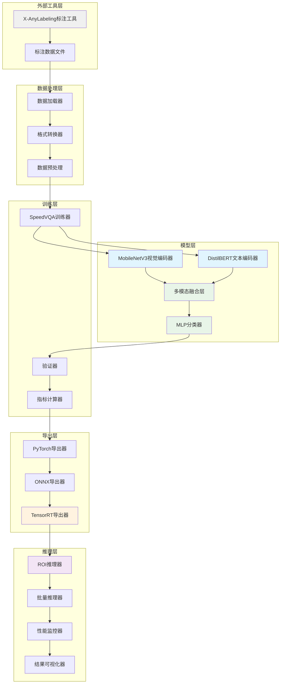
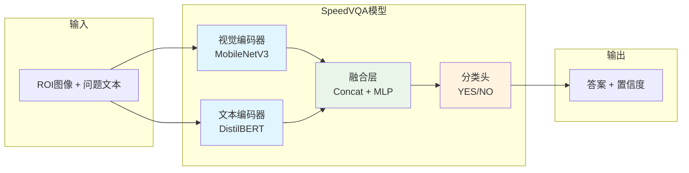
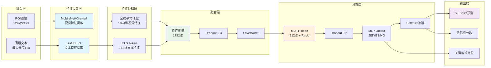
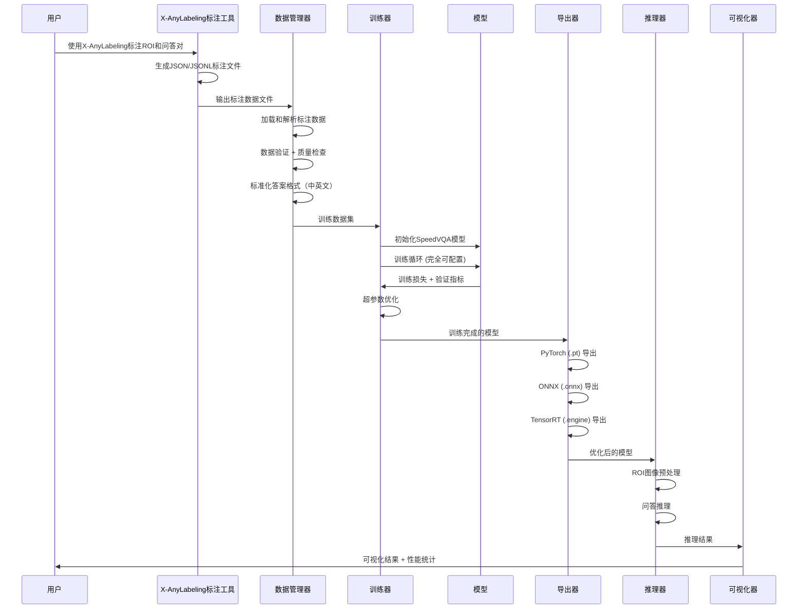

# 设计文档

## 概述

SpeedVQA是一个专为极速视觉问答任务设计的完整解决方案，采用模块化全栈架构，专注于YES/NO问答任务。系统通过MobileNetV3 + DistilBERT + MLP的轻量化架构，在T4显卡上实现毫秒级推理性能，为垂直行业提供快速适配的VQA能力。

### 核心设计原则

1. **解耦设计**：各模块独立开发、测试和部署
2. **配置驱动**：通过配置文件控制系统行为和扩展
3. **性能优先**：针对T4显卡优化，实现<50ms推理延迟
4. **扩展性**：预留接口支持未来功能扩展
5. **阶段实施**：Phase 1+2优先，确保核心功能稳定

### 技术选型

- **深度学习框架**：PyTorch + PyTorch Lightning
- **视觉编码器**：MobileNetV3-small（轻量化，适合移动端部署）
- **文本编码器**：DistilBERT-base-uncased（固定问题编码）
- **优化工具**：TensorRT（T4显卡专用优化）
- **训练优化**：混合精度训练（FP16）+ 梯度累积
- **推理优化**：批处理 + 内存池 + 异步处理

## 架构

### 系统整体架构（v1版本 - 核心训练推理）



### 简化的YOLO风格架构



### SpeedVQA模型架构



### 数据流架构



## 组件和接口

### 核心组件设计（v1版本）

#### 1. 数据加载组件 (DataLoader) - 支持X-AnyLabeling格式

```python
class VQADataset(Dataset):
    """VQA数据集加载器（完全兼容X-AnyLabeling）"""
    
    def __init__(self, data_path: str, config: Dict):
        self.data_path = data_path
        self.config = config
        self.samples = self._load_samples()
        self.transform = self._build_transforms()
        self.tokenizer = DistilBertTokenizer.from_pretrained('distilbert-base-uncased')
    
    def _load_samples(self) -> List[Dict]:
        """加载训练样本（支持X-AnyLabeling的两种格式）"""
        samples = []
        
        # 格式1: 支持单个JSON文件（X-AnyLabeling单张图片标注）
        json_files = glob.glob(os.path.join(self.data_path, 'annotations', '*.json'))
        for json_file in json_files:
            samples.extend(self._load_from_single_json(json_file))
        
        # 格式2: 支持JSONL文件（X-AnyLabeling批量标注）
        jsonl_file = os.path.join(self.data_path, 'vqa_labels.jsonl')
        if os.path.exists(jsonl_file):
            samples.extend(self._load_from_jsonl(jsonl_file))
        
        # 格式3: 支持简单的questions.txt格式（向后兼容）
        questions_file = os.path.join(self.data_path, 'questions.txt')
        if os.path.exists(questions_file):
            samples.extend(self._load_from_txt(questions_file))
        
        print(f"Loaded {len(samples)} VQA samples from {self.data_path}")
        return samples
    
    def _load_from_single_json(self, json_file: str) -> List[Dict]:
        """从X-AnyLabeling单个JSON文件加载数据"""
        with open(json_file, 'r', encoding='utf-8') as f:
            data = json.load(f)
        
        samples = []
        image_path = os.path.join(self.data_path, 'images', data['imagePath'])
        
        # 解析vqaData字段
        if 'vqaData' in data and data['vqaData']:
            for question, answer in data['vqaData'].items():
                # 处理答案格式（可能是字符串或列表）
                if isinstance(answer, list):
                    answer_text = answer[0] if answer else "否"
                else:
                    answer_text = answer
                
                # 标准化答案格式
                normalized_answer = self._normalize_answer(answer_text)
                
                samples.append({
                    'image_path': image_path,
                    'question': question.strip(),
                    'answer': normalized_answer,
                    'source': 'x_anylabeling_json',
                    'metadata': {
                        'image_width': data.get('imageWidth', 0),
                        'image_height': data.get('imageHeight', 0),
                        'version': data.get('version', 'unknown')
                    }
                })
        
        return samples
    
    def _load_from_jsonl(self, jsonl_file: str) -> List[Dict]:
        """从X-AnyLabeling JSONL文件加载数据"""
        samples = []
        
        with open(jsonl_file, 'r', encoding='utf-8') as f:
            for line in f:
                data = json.loads(line.strip())
                
                image_path = os.path.join(self.data_path, 'images', data['image'])
                
                # 遍历所有问答对（除了image, width, height字段）
                for key, value in data.items():
                    if key not in ['image', 'width', 'height']:
                        question = key
                        
                        # 处理答案格式
                        if isinstance(value, list):
                            answer_text = value[0] if value else "否"
                        else:
                            answer_text = value
                        
                        # 标准化答案格式
                        normalized_answer = self._normalize_answer(answer_text)
                        
                        samples.append({
                            'image_path': image_path,
                            'question': question.strip(),
                            'answer': normalized_answer,
                            'source': 'x_anylabeling_jsonl',
                            'metadata': {
                                'image_width': data.get('width', 0),
                                'image_height': data.get('height', 0)
                            }
                        })
        
        return samples
    
    def _load_from_txt(self, txt_file: str) -> List[Dict]:
        """从questions.txt加载数据（向后兼容）"""
        samples = []
        with open(txt_file, 'r', encoding='utf-8') as f:
            for line in f:
                parts = line.strip().split(',')
                if len(parts) >= 7:
                    samples.append({
                        'image_path': os.path.join(self.data_path, 'images', parts[0]),
                        'bbox': [int(parts[1]), int(parts[2]), int(parts[3]), int(parts[4])],
                        'question': parts[5],
                        'answer': self._normalize_answer(parts[6]),
                        'source': 'questions_txt'
                    })
        return samples
    
    def _normalize_answer(self, answer: str) -> str:
        """标准化答案格式"""
        answer = answer.strip().lower()
        
        # 中文答案映射
        if answer in ['是', 'yes', 'y', '1', 'true']:
            return 'YES'
        elif answer in ['否', '不是', 'no', 'n', '0', 'false']:
            return 'NO'
        else:
            # 默认处理：如果包含肯定词汇则为YES，否则为NO
            positive_words = ['是', 'yes', 'y', '有', '存在', '正确']
            if any(word in answer for word in positive_words):
                return 'YES'
            else:
                return 'NO'
    
    def _build_transforms(self):
        """构建图像预处理变换"""
        return transforms.Compose([
            transforms.Resize((224, 224)),
            transforms.ToTensor(),
            transforms.Normalize(
                mean=[0.485, 0.456, 0.406],
                std=[0.229, 0.224, 0.225]
            )
        ])
    
    def __getitem__(self, idx: int) -> Dict[str, torch.Tensor]:
        """获取单个训练样本"""
        sample = self.samples[idx]
        
        # 加载和预处理图像
        try:
            image = Image.open(sample['image_path']).convert('RGB')
            
            # 如果有bbox信息，裁剪ROI区域
            if 'bbox' in sample:
                x, y, w, h = sample['bbox']
                image = image.crop((x, y, x+w, y+h))
            
            image = self.transform(image)
        except Exception as e:
            print(f"Error loading image {sample['image_path']}: {e}")
            # 创建一个默认的黑色图像
            image = torch.zeros(3, 224, 224)
        
        # 预处理文本
        text_inputs = self.tokenizer(
            sample['question'],
            max_length=128,
            padding='max_length',
            truncation=True,
            return_tensors='pt'
        )
        
        # 标签编码
        label = 1 if sample['answer'] == 'YES' else 0
        
        return {
            'image': image,
            'input_ids': text_inputs['input_ids'].squeeze(),
            'attention_mask': text_inputs['attention_mask'].squeeze(),
            'label': torch.tensor(label, dtype=torch.long),
            'question': sample['question'],  # 保留原始问题用于调试
            'answer': sample['answer']       # 保留原始答案用于调试
        }
    
    def __len__(self) -> int:
        return len(self.samples)
    
    def get_class_distribution(self) -> Dict[str, int]:
        """获取类别分布统计"""
        distribution = {'YES': 0, 'NO': 0}
        for sample in self.samples:
            distribution[sample['answer']] += 1
        return distribution
    
    def get_question_statistics(self) -> Dict[str, int]:
        """获取问题统计"""
        question_counts = {}
        for sample in self.samples:
            question = sample['question']
            question_counts[question] = question_counts.get(question, 0) + 1
        return question_counts

def build_dataset(data_path: str, config: Dict, split: str = 'train') -> VQADataset:
    """构建数据集（YOLO风格的简单接口）"""
    dataset = VQADataset(data_path, config)
    
    # 打印数据集统计信息
    print(f"\n=== {split.upper()} Dataset Statistics ===")
    print(f"Total samples: {len(dataset)}")
    
    class_dist = dataset.get_class_distribution()
    print(f"Class distribution: {class_dist}")
    
    question_stats = dataset.get_question_statistics()
    print(f"Unique questions: {len(question_stats)}")
    for question, count in sorted(question_stats.items(), key=lambda x: x[1], reverse=True)[:5]:
        print(f"  '{question}': {count} samples")
    
    return dataset

# 数据集划分工具
def split_dataset(dataset: VQADataset, train_ratio: float = 0.7, 
                 val_ratio: float = 0.2, test_ratio: float = 0.1) -> Tuple[Dataset, Dataset, Dataset]:
    """划分数据集为训练/验证/测试集"""
    
    total_size = len(dataset)
    train_size = int(total_size * train_ratio)
    val_size = int(total_size * val_ratio)
    test_size = total_size - train_size - val_size
    
    # 使用随机划分
    train_dataset, val_dataset, test_dataset = random_split(
        dataset, 
        [train_size, val_size, test_size],
        generator=torch.Generator().manual_seed(42)  # 固定随机种子确保可重现
    )
    
    print(f"\nDataset split:")
    print(f"Train: {len(train_dataset)} samples ({len(train_dataset)/total_size*100:.1f}%)")
    print(f"Val: {len(val_dataset)} samples ({len(val_dataset)/total_size*100:.1f}%)")
    print(f"Test: {len(test_dataset)} samples ({len(test_dataset)/total_size*100:.1f}%)")
    
    return train_dataset, val_dataset, test_dataset
```

#### 2. SpeedVQA模型组件 (完全可配置)

```python
import torch
import torch.nn as nn
from transformers import AutoModel, AutoTokenizer
import timm
from typing import Dict, Any

class SpeedVQAModel(nn.Module):
    """完全可配置的SpeedVQA模型"""
    
    def __init__(self, config: Dict[str, Any]):
        super().__init__()
        self.config = config
        
        # 从配置构建视觉编码器
        self.vision_encoder = self._build_vision_encoder(config['model']['vision'])
        
        # 从配置构建文本编码器
        self.text_encoder = self._build_text_encoder(config['model']['text'])
        
        # 从配置构建融合层
        self.fusion_layer = self._build_fusion_layer(config['model']['fusion'])
        
        # 从配置构建分类器
        self.classifier = self._build_classifier(config['model']['classifier'])
        
        # 初始化权重
        self._initialize_weights()
    
    def _build_vision_encoder(self, vision_config: Dict) -> nn.Module:
        """根据配置构建视觉编码器"""
        backbone_name = vision_config['backbone']
        pretrained = vision_config.get('pretrained', True)
        feature_dim = vision_config['feature_dim']
        dropout = vision_config.get('dropout', 0.1)
        
        if 'mobilenet' in backbone_name:
            # 使用timm库加载MobileNet
            backbone = timm.create_model(
                backbone_name, 
                pretrained=pretrained,
                num_classes=0,  # 移除分类头
                global_pool=''  # 移除全局池化
            )
            
            # 获取特征维度
            with torch.no_grad():
                dummy_input = torch.randn(1, 3, 224, 224)
                backbone_features = backbone(dummy_input)
                backbone_dim = backbone_features.shape[1]
            
            # 添加自适应池化和投影层
            vision_encoder = nn.Sequential(
                backbone,
                nn.AdaptiveAvgPool2d((1, 1)),
                nn.Flatten(),
                nn.Linear(backbone_dim, feature_dim),
                nn.ReLU(),
                nn.Dropout(dropout)
            )
        
        elif 'resnet' in backbone_name or 'efficientnet' in backbone_name:
            # 支持其他backbone
            backbone = timm.create_model(
                backbone_name,
                pretrained=pretrained,
                num_classes=feature_dim
            )
            vision_encoder = nn.Sequential(
                backbone,
                nn.Dropout(dropout)
            )
        
        else:
            raise ValueError(f"Unsupported vision backbone: {backbone_name}")
        
        return vision_encoder
    
    def _build_text_encoder(self, text_config: Dict) -> nn.Module:
        """根据配置构建文本编码器"""
        encoder_name = text_config['encoder']
        feature_dim = text_config['feature_dim']
        freeze_encoder = text_config.get('freeze_encoder', False)
        
        # 加载预训练文本编码器
        text_encoder = AutoModel.from_pretrained(encoder_name)
        
        # 是否冻结编码器参数
        if freeze_encoder:
            for param in text_encoder.parameters():
                param.requires_grad = False
        
        # 添加投影层（如果需要）
        encoder_dim = text_encoder.config.hidden_size
        if encoder_dim != feature_dim:
            projection = nn.Linear(encoder_dim, feature_dim)
            text_encoder = nn.Sequential(text_encoder, projection)
        
        return text_encoder
    
    def _build_fusion_layer(self, fusion_config: Dict) -> nn.Module:
        """根据配置构建融合层"""
        method = fusion_config.get('method', 'concat')
        hidden_dim = fusion_config['hidden_dim']
        dropout = fusion_config.get('dropout', 0.3)
        use_layer_norm = fusion_config.get('use_layer_norm', True)
        
        if method == 'concat':
            # 简单拼接融合
            layers = [
                nn.Linear(hidden_dim, hidden_dim),
                nn.ReLU(),
                nn.Dropout(dropout)
            ]
            
            if use_layer_norm:
                layers.insert(-1, nn.LayerNorm(hidden_dim))
            
            fusion_layer = nn.Sequential(*layers)
        
        elif method == 'attention':
            # 注意力融合
            fusion_layer = AttentionFusion(
                hidden_dim // 2,  # 假设vision和text特征维度相等
                hidden_dim,
                dropout
            )
        
        elif method == 'bilinear':
            # 双线性融合
            vision_dim = hidden_dim // 2
            text_dim = hidden_dim // 2
            fusion_layer = BilinearFusion(vision_dim, text_dim, hidden_dim, dropout)
        
        else:
            raise ValueError(f"Unsupported fusion method: {method}")
        
        return fusion_layer
    
    def _build_classifier(self, classifier_config: Dict) -> nn.Module:
        """根据配置构建分类器"""
        hidden_dims = classifier_config['hidden_dims']
        num_classes = classifier_config['num_classes']
        dropout = classifier_config.get('dropout', 0.2)
        activation = classifier_config.get('activation', 'relu')
        
        # 激活函数映射
        activation_map = {
            'relu': nn.ReLU,
            'gelu': nn.GELU,
            'swish': nn.SiLU,
            'leaky_relu': nn.LeakyReLU
        }
        
        act_fn = activation_map.get(activation, nn.ReLU)
        
        # 构建多层分类器
        layers = []
        input_dim = hidden_dims[0] if len(hidden_dims) > 1 else hidden_dims[0]
        
        for i, hidden_dim in enumerate(hidden_dims[:-1]):
            layers.extend([
                nn.Linear(input_dim if i == 0 else hidden_dims[i-1], hidden_dim),
                act_fn(),
                nn.Dropout(dropout)
            ])
        
        # 输出层
        layers.append(nn.Linear(hidden_dims[-1], num_classes))
        
        return nn.Sequential(*layers)
    
    def _initialize_weights(self):
        """初始化权重"""
        for module in self.modules():
            if isinstance(module, nn.Linear):
                nn.init.xavier_uniform_(module.weight)
                if module.bias is not None:
                    nn.init.zeros_(module.bias)
            elif isinstance(module, nn.LayerNorm):
                nn.init.ones_(module.weight)
                nn.init.zeros_(module.bias)
    
    def forward(self, images: torch.Tensor, 
                input_ids: torch.Tensor,
                attention_mask: torch.Tensor) -> Dict[str, torch.Tensor]:
        """前向传播"""
        
        # 视觉特征提取
        vision_features = self.vision_encoder(images)  # [B, vision_dim]
        
        # 文本特征提取
        if isinstance(self.text_encoder, nn.Sequential):
            # 如果有投影层
            text_outputs = self.text_encoder[0](
                input_ids=input_ids,
                attention_mask=attention_mask
            )
            text_features = text_outputs.last_hidden_state[:, 0, :]  # CLS token
            text_features = self.text_encoder[1](text_features)  # 投影
        else:
            text_outputs = self.text_encoder(
                input_ids=input_ids,
                attention_mask=attention_mask
            )
            text_features = text_outputs.last_hidden_state[:, 0, :]  # CLS token
        
        # 多模态特征融合
        if self.config['model']['fusion']['method'] == 'concat':
            fused_features = torch.cat([vision_features, text_features], dim=1)
            fused_features = self.fusion_layer(fused_features)
        else:
            fused_features = self.fusion_layer(vision_features, text_features)
        
        # 分类预测
        classification_logits = self.classifier(fused_features)
        
        return {
            'classification_logits': classification_logits,
            'vision_features': vision_features,
            'text_features': text_features,
            'fused_features': fused_features
        }

class AttentionFusion(nn.Module):
    """注意力融合模块"""
    
    def __init__(self, feature_dim: int, output_dim: int, dropout: float = 0.1):
        super().__init__()
        self.attention = nn.MultiheadAttention(
            embed_dim=feature_dim,
            num_heads=8,
            dropout=dropout,
            batch_first=True
        )
        self.projection = nn.Linear(feature_dim, output_dim)
        self.layer_norm = nn.LayerNorm(output_dim)
        self.dropout = nn.Dropout(dropout)
    
    def forward(self, vision_features: torch.Tensor, 
                text_features: torch.Tensor) -> torch.Tensor:
        # 将特征reshape为序列格式
        features = torch.stack([vision_features, text_features], dim=1)  # [B, 2, D]
        
        # 自注意力
        attended_features, _ = self.attention(features, features, features)
        
        # 平均池化
        fused_features = attended_features.mean(dim=1)  # [B, D]
        
        # 投影和标准化
        output = self.projection(fused_features)
        output = self.layer_norm(output)
        output = self.dropout(output)
        
        return output

class BilinearFusion(nn.Module):
    """双线性融合模块"""
    
    def __init__(self, vision_dim: int, text_dim: int, 
                 output_dim: int, dropout: float = 0.1):
        super().__init__()
        self.bilinear = nn.Bilinear(vision_dim, text_dim, output_dim)
        self.dropout = nn.Dropout(dropout)
    
    def forward(self, vision_features: torch.Tensor, 
                text_features: torch.Tensor) -> torch.Tensor:
        fused_features = self.bilinear(vision_features, text_features)
        return self.dropout(fused_features)

def build_model(config: Dict[str, Any]) -> SpeedVQAModel:
    """根据配置构建模型"""
    model = SpeedVQAModel(config)
    
    # 打印模型信息
    total_params = sum(p.numel() for p in model.parameters())
    trainable_params = sum(p.numel() for p in model.parameters() if p.requires_grad)
    
    print(f"Model: {config['model']['name']}")
    print(f"Total parameters: {total_params:,}")
    print(f"Trainable parameters: {trainable_params:,}")
    print(f"Vision backbone: {config['model']['vision']['backbone']}")
    print(f"Text encoder: {config['model']['text']['encoder']}")
    print(f"Fusion method: {config['model']['fusion']['method']}")
    
    return model
```

#### 3. 完全可配置的训练系统

```python
def train(config_path: str = 'configs/default.yaml', **kwargs):
    """完全可配置的YOLO风格训练接口"""
    
    # 加载配置
    config = load_config(config_path, **kwargs)
    
    # 设置设备
    device = torch.device(config['train']['device'] if torch.cuda.is_available() else 'cpu')
    print(f"Using device: {device}")
    
    # 设置随机种子
    torch.manual_seed(config['data']['split']['random_seed'])
    
    # 构建数据集
    full_dataset = build_dataset(config['data']['dataset_path'], config)
    
    # 划分数据集
    train_dataset, val_dataset, test_dataset = split_dataset(
        full_dataset,
        config['data']['split']['train_ratio'],
        config['data']['split']['val_ratio'],
        config['data']['split']['test_ratio']
    )
    
    # 构建数据加载器
    train_loader = DataLoader(
        train_dataset,
        batch_size=config['data']['dataloader']['batch_size'],
        shuffle=config['data']['dataloader']['shuffle'],
        num_workers=config['data']['dataloader']['num_workers'],
        pin_memory=config['data']['dataloader']['pin_memory'],
        drop_last=config['data']['dataloader']['drop_last']
    )
    
    val_loader = DataLoader(
        val_dataset,
        batch_size=config['val']['batch_size'],
        shuffle=False,
        num_workers=config['val']['num_workers'],
        pin_memory=True
    )
    
    # 构建模型
    model = build_model(config).to(device)
    
    # 构建损失函数
    criterion = build_criterion(config['model']['loss'])
    
    # 构建优化器
    optimizer = build_optimizer(model, config['train']['optimizer'])
    
    # 构建学习率调度器
    scheduler = build_scheduler(optimizer, config['train']['scheduler'])
    
    # 构建训练器
    trainer = ConfigurableTrainer(
        model=model,
        criterion=criterion,
        optimizer=optimizer,
        scheduler=scheduler,
        config=config,
        device=device
    )
    
    # 开始训练
    best_model_path = trainer.fit(train_loader, val_loader)
    
    print(f"Training completed. Best model saved to: {best_model_path}")
    return best_model_path

class ConfigurableTrainer:
    """完全可配置的训练器"""
    
    def __init__(self, model, criterion, optimizer, scheduler, config, device):
        self.model = model
        self.criterion = criterion
        self.optimizer = optimizer
        self.scheduler = scheduler
        self.config = config
        self.device = device
        
        # 训练状态
        self.current_epoch = 0
        self.best_metric = 0.0
        self.best_model_path = None
        
        # 早停
        self.early_stopping = EarlyStopping(
            patience=config['train']['strategy']['early_stopping']['patience'],
            min_delta=config['train']['strategy']['early_stopping']['min_delta']
        ) if config['train']['strategy']['early_stopping']['enabled'] else None
        
        # 混合精度
        self.scaler = torch.cuda.amp.GradScaler() if config['train']['strategy']['mixed_precision'] else None
        
        # 日志记录
        self.setup_logging()
    
    def setup_logging(self):
        """设置日志记录"""
        self.save_dir = Path(self.config['train']['save_dir']) / self.config['train']['experiment_name']
        self.save_dir.mkdir(parents=True, exist_ok=True)
        
        # TensorBoard
        if self.config['train']['logging']['tensorboard']:
            from torch.utils.tensorboard import SummaryWriter
            self.writer = SummaryWriter(self.save_dir / 'tensorboard')
        
        # Weights & Biases
        if self.config['train']['logging']['wandb']['enabled']:
            import wandb
            wandb.init(
                project=self.config['train']['logging']['wandb']['project'],
                entity=self.config['train']['logging']['wandb']['entity'],
                config=self.config,
                name=self.config['train']['experiment_name']
            )
    
    def fit(self, train_loader, val_loader):
        """训练主循环"""
        print(f"Starting training for {self.config['train']['epochs']} epochs...")
        
        for epoch in range(self.config['train']['epochs']):
            self.current_epoch = epoch
            
            # 训练一个epoch
            train_metrics = self.train_epoch(train_loader)
            
            # 验证
            if epoch % self.config['train']['validation']['interval'] == 0:
                val_metrics = self.validate_epoch(val_loader)
                
                # 更新最佳模型
                current_metric = val_metrics[self.config['train']['validation']['metric']]
                if current_metric > self.best_metric:
                    self.best_metric = current_metric
                    self.best_model_path = self.save_checkpoint(is_best=True)
                
                # 早停检查
                if self.early_stopping:
                    self.early_stopping(current_metric)
                    if self.early_stopping.early_stop:
                        print(f"Early stopping at epoch {epoch}")
                        break
                
                # 记录日志
                self.log_metrics(train_metrics, val_metrics, epoch)
            
            # 学习率调度
            if self.scheduler:
                if isinstance(self.scheduler, torch.optim.lr_scheduler.ReduceLROnPlateau):
                    self.scheduler.step(val_metrics[self.config['train']['validation']['metric']])
                else:
                    self.scheduler.step()
            
            # 保存检查点
            if epoch % self.config['train']['logging']['save_checkpoint_interval'] == 0:
                self.save_checkpoint(is_best=False)
        
        return self.best_model_path
    
    def train_epoch(self, train_loader):
        """训练一个epoch"""
        self.model.train()
        
        total_loss = 0.0
        correct = 0
        total = 0
        
        for batch_idx, batch in enumerate(train_loader):
            # 数据移动到设备
            images = batch['image'].to(self.device)
            input_ids = batch['input_ids'].to(self.device)
            attention_mask = batch['attention_mask'].to(self.device)
            labels = batch['label'].to(self.device)
            
            # 前向传播
            if self.scaler:  # 混合精度
                with torch.cuda.amp.autocast():
                    outputs = self.model(images, input_ids, attention_mask)
                    loss = self.criterion(outputs['classification_logits'], labels)
            else:
                outputs = self.model(images, input_ids, attention_mask)
                loss = self.criterion(outputs['classification_logits'], labels)
            
            # 反向传播
            self.optimizer.zero_grad()
            
            if self.scaler:
                self.scaler.scale(loss).backward()
                
                # 梯度裁剪
                if self.config['train']['strategy']['max_grad_norm'] > 0:
                    self.scaler.unscale_(self.optimizer)
                    torch.nn.utils.clip_grad_norm_(
                        self.model.parameters(),
                        self.config['train']['strategy']['max_grad_norm']
                    )
                
                self.scaler.step(self.optimizer)
                self.scaler.update()
            else:
                loss.backward()
                
                # 梯度裁剪
                if self.config['train']['strategy']['max_grad_norm'] > 0:
                    torch.nn.utils.clip_grad_norm_(
                        self.model.parameters(),
                        self.config['train']['strategy']['max_grad_norm']
                    )
                
                self.optimizer.step()
            
            # 统计
            total_loss += loss.item()
            _, predicted = torch.max(outputs['classification_logits'], 1)
            total += labels.size(0)
            correct += (predicted == labels).sum().item()
            
            # 打印日志
            if batch_idx % self.config['train']['logging']['log_interval'] == 0:
                print(f'Epoch: {self.current_epoch}, Batch: {batch_idx}, '
                      f'Loss: {loss.item():.4f}, '
                      f'Acc: {100.*correct/total:.2f}%')
        
        return {
            'loss': total_loss / len(train_loader),
            'accuracy': correct / total
        }
    
    def validate_epoch(self, val_loader):
        """验证一个epoch"""
        self.model.eval()
        
        total_loss = 0.0
        correct = 0
        total = 0
        all_predictions = []
        all_labels = []
        
        with torch.no_grad():
            for batch in val_loader:
                images = batch['image'].to(self.device)
                input_ids = batch['input_ids'].to(self.device)
                attention_mask = batch['attention_mask'].to(self.device)
                labels = batch['label'].to(self.device)
                
                outputs = self.model(images, input_ids, attention_mask)
                loss = self.criterion(outputs['classification_logits'], labels)
                
                total_loss += loss.item()
                _, predicted = torch.max(outputs['classification_logits'], 1)
                total += labels.size(0)
                correct += (predicted == labels).sum().item()
                
                all_predictions.extend(predicted.cpu().numpy())
                all_labels.extend(labels.cpu().numpy())
        
        # 计算详细指标
        from sklearn.metrics import precision_score, recall_score, f1_score, roc_auc_score
        
        precision = precision_score(all_labels, all_predictions, average='weighted')
        recall = recall_score(all_labels, all_predictions, average='weighted')
        f1 = f1_score(all_labels, all_predictions, average='weighted')
        
        return {
            'loss': total_loss / len(val_loader),
            'accuracy': correct / total,
            'precision': precision,
            'recall': recall,
            'f1': f1
        }
    
    def save_checkpoint(self, is_best=False):
        """保存检查点"""
        checkpoint = {
            'epoch': self.current_epoch,
            'model_state_dict': self.model.state_dict(),
            'optimizer_state_dict': self.optimizer.state_dict(),
            'scheduler_state_dict': self.scheduler.state_dict() if self.scheduler else None,
            'best_metric': self.best_metric,
            'config': self.config
        }
        
        if is_best:
            save_path = self.save_dir / 'best_model.pt'
        else:
            save_path = self.save_dir / f'checkpoint_epoch_{self.current_epoch}.pt'
        
        torch.save(checkpoint, save_path)
        return str(save_path)
    
    def log_metrics(self, train_metrics, val_metrics, epoch):
        """记录指标"""
        # TensorBoard
        if hasattr(self, 'writer'):
            for key, value in train_metrics.items():
                self.writer.add_scalar(f'Train/{key}', value, epoch)
            for key, value in val_metrics.items():
                self.writer.add_scalar(f'Val/{key}', value, epoch)
        
        # Weights & Biases
        if self.config['train']['logging']['wandb']['enabled']:
            import wandb
            log_dict = {}
            for key, value in train_metrics.items():
                log_dict[f'train_{key}'] = value
            for key, value in val_metrics.items():
                log_dict[f'val_{key}'] = value
            wandb.log(log_dict, step=epoch)

def build_criterion(loss_config: Dict):
    """根据配置构建损失函数"""
    loss_type = loss_config['type']
    
    if loss_type == 'cross_entropy':
        weight = loss_config.get('weight')
        if weight:
            weight = torch.tensor(weight, dtype=torch.float32)
        
        label_smoothing = loss_config.get('label_smoothing', 0.0)
        return nn.CrossEntropyLoss(weight=weight, label_smoothing=label_smoothing)
    
    elif loss_type == 'focal_loss':
        from .losses import FocalLoss
        return FocalLoss(
            alpha=loss_config.get('focal_alpha', 0.25),
            gamma=loss_config.get('focal_gamma', 2.0)
        )
    
    else:
        raise ValueError(f"Unsupported loss type: {loss_type}")

def build_optimizer(model, optimizer_config: Dict):
    """根据配置构建优化器"""
    optimizer_type = optimizer_config['type'].lower()
    
    if optimizer_type == 'adamw':
        return torch.optim.AdamW(
            model.parameters(),
            lr=optimizer_config['lr'],
            weight_decay=optimizer_config['weight_decay'],
            betas=optimizer_config.get('betas', [0.9, 0.999]),
            eps=optimizer_config.get('eps', 1e-8),
            amsgrad=optimizer_config.get('amsgrad', False)
        )
    
    elif optimizer_type == 'adam':
        return torch.optim.Adam(
            model.parameters(),
            lr=optimizer_config['lr'],
            weight_decay=optimizer_config['weight_decay'],
            betas=optimizer_config.get('betas', [0.9, 0.999])
        )
    
    elif optimizer_type == 'sgd':
        return torch.optim.SGD(
            model.parameters(),
            lr=optimizer_config['lr'],
            weight_decay=optimizer_config['weight_decay'],
            momentum=optimizer_config.get('momentum', 0.9)
        )
    
    else:
        raise ValueError(f"Unsupported optimizer type: {optimizer_type}")

def build_scheduler(optimizer, scheduler_config: Dict):
    """根据配置构建学习率调度器"""
    scheduler_type = scheduler_config['type'].lower()
    
    if scheduler_type == 'cosine':
        return torch.optim.lr_scheduler.CosineAnnealingLR(
            optimizer,
            T_max=scheduler_config.get('T_max', 100),
            eta_min=scheduler_config.get('min_lr', 1e-6)
        )
    
    elif scheduler_type == 'step':
        return torch.optim.lr_scheduler.StepLR(
            optimizer,
            step_size=scheduler_config.get('step_size', 30),
            gamma=scheduler_config.get('gamma', 0.1)
        )
    
    elif scheduler_type == 'plateau':
        return torch.optim.lr_scheduler.ReduceLROnPlateau(
            optimizer,
            mode='max',
            patience=scheduler_config.get('patience', 10),
            factor=scheduler_config.get('factor', 0.5)
        )
    
    else:
        return None

class EarlyStopping:
    """早停机制"""
    
    def __init__(self, patience=7, min_delta=0.001):
        self.patience = patience
        self.min_delta = min_delta
        self.counter = 0
        self.best_score = None
        self.early_stop = False
    
    def __call__(self, val_score):
        if self.best_score is None:
            self.best_score = val_score
        elif val_score < self.best_score + self.min_delta:
            self.counter += 1
            if self.counter >= self.patience:
                self.early_stop = True
        else:
            self.best_score = val_score
            self.counter = 0
```

#### 4. 简化的推理组件 (Inference)

```python
class ROIInferencer:
    """简化的ROI推理器"""
    
    def __init__(self, model_path: str, device: str = 'cuda'):
        self.device = torch.device(device)
        self.model = self._load_model(model_path)
        self.transform = self._build_transform()
        self.tokenizer = DistilBertTokenizer.from_pretrained('distilbert-base-uncased')
    
    def _load_model(self, model_path: str):
        """加载模型"""
        if model_path.endswith('.pt'):
            checkpoint = torch.load(model_path, map_location=self.device)
            model = SpeedVQAModel(checkpoint['config'])
            model.load_state_dict(checkpoint['model_state_dict'])
        elif model_path.endswith('.onnx'):
            import onnxruntime as ort
            model = ort.InferenceSession(model_path)
        elif model_path.endswith('.engine'):
            import tensorrt as trt
            # TensorRT加载逻辑
            model = self._load_tensorrt_engine(model_path)
        else:
            raise ValueError(f"Unsupported model format: {model_path}")
        
        if hasattr(model, 'eval'):
            model.eval()
        
        return model
    
    def predict_image(self, image_path: str, question: str) -> Dict:
        """预测单张图像"""
        # 加载图像
        image = Image.open(image_path).convert('RGB')
        image_tensor = self.transform(image).unsqueeze(0).to(self.device)
        
        # 处理文本
        text_inputs = self.tokenizer(
            question,
            max_length=128,
            padding='max_length',
            truncation=True,
            return_tensors='pt'
        ).to(self.device)
        
        # 推理
        start_time = time.time()
        with torch.no_grad():
            outputs = self.model(
                image_tensor,
                text_inputs['input_ids'],
                text_inputs['attention_mask']
            )
        
        inference_time = (time.time() - start_time) * 1000  # 转换为毫秒
        
        # 后处理
        probabilities = torch.softmax(outputs['classification_logits'], dim=1)
        confidence = torch.max(probabilities).item()
        prediction = torch.argmax(probabilities).item()
        answer = "YES" if prediction == 1 else "NO"
        
        return {
            'answer': answer,
            'confidence': confidence,
            'inference_time_ms': inference_time,
            'probabilities': probabilities.cpu().numpy().tolist()
        }
    
    def predict_batch(self, image_paths: List[str], questions: List[str]) -> List[Dict]:
        """批量预测"""
        results = []
        
        # 批量预处理
        images = []
        text_inputs_batch = []
        
        for img_path, question in zip(image_paths, questions):
            image = Image.open(img_path).convert('RGB')
            images.append(self.transform(image))
            
            text_inputs = self.tokenizer(
                question,
                max_length=128,
                padding='max_length',
                truncation=True,
                return_tensors='pt'
            )
            text_inputs_batch.append(text_inputs)
        
        # 转换为批量张量
        images_tensor = torch.stack(images).to(self.device)
        input_ids = torch.cat([t['input_ids'] for t in text_inputs_batch]).to(self.device)
        attention_mask = torch.cat([t['attention_mask'] for t in text_inputs_batch]).to(self.device)
        
        # 批量推理
        start_time = time.time()
        with torch.no_grad():
            outputs = self.model(images_tensor, input_ids, attention_mask)
        
        total_time = (time.time() - start_time) * 1000
        avg_time = total_time / len(image_paths)
        
        # 批量后处理
        probabilities = torch.softmax(outputs['classification_logits'], dim=1)
        
        for i in range(len(image_paths)):
            confidence = torch.max(probabilities[i]).item()
            prediction = torch.argmax(probabilities[i]).item()
            answer = "YES" if prediction == 1 else "NO"
            
            results.append({
                'answer': answer,
                'confidence': confidence,
                'inference_time_ms': avg_time,
                'probabilities': probabilities[i].cpu().numpy().tolist()
            })
        
        return results
```

```python
import pytorch_lightning as pl
from torch.optim import AdamW
from torch.optim.lr_scheduler import CosineAnnealingLR

class SpeedVQATrainer(pl.LightningModule):
    """PyTorch Lightning训练器"""
    
    def __init__(self, model: SpeedVQAModel, config: Dict):
        super().__init__()
        self.model = model
        self.config = config
        self.save_hyperparameters()
        
        # 损失函数
        self.classification_loss = nn.CrossEntropyLoss()
        self.region_loss = nn.MSELoss()
        
        # 性能监控
        self.train_accuracy = torchmetrics.Accuracy(task='binary')
        self.val_accuracy = torchmetrics.Accuracy(task='binary')
    
    def training_step(self, batch, batch_idx):
        """训练步骤"""
        images, text_ids, text_mask, labels, regions = batch
        
        outputs = self.model(images, text_ids, text_mask)
        
        # 计算损失
        cls_loss = self.classification_loss(outputs['classification_logits'], labels)
        reg_loss = self.region_loss(outputs['region_coords'], regions)
        total_loss = cls_loss + 0.1 * reg_loss  # 加权损失
        
        # 记录指标
        self.log('train_loss', total_loss, prog_bar=True)
        self.log('train_cls_loss', cls_loss)
        self.log('train_reg_loss', reg_loss)
        
        return total_loss
    
    def validation_step(self, batch, batch_idx):
        """验证步骤"""
        images, text_ids, text_mask, labels, regions = batch
        
        outputs = self.model(images, text_ids, text_mask)
        
        # 计算损失和准确率
        cls_loss = self.classification_loss(outputs['classification_logits'], labels)
        reg_loss = self.region_loss(outputs['region_coords'], regions)
        total_loss = cls_loss + 0.1 * reg_loss
        
        # 计算准确率
        preds = torch.argmax(outputs['classification_logits'], dim=1)
        acc = self.val_accuracy(preds, labels)
        
        self.log('val_loss', total_loss, prog_bar=True)
        self.log('val_accuracy', acc, prog_bar=True)
        
        return total_loss
    
    def configure_optimizers(self):
        """配置优化器和学习率调度器"""
        optimizer = AdamW(
            self.parameters(),
            lr=self.config['learning_rate'],
            weight_decay=self.config['weight_decay']
        )
        
        scheduler = CosineAnnealingLR(
            optimizer,
            T_max=self.config['max_epochs'],
            eta_min=1e-6
        )
        
        return {
            'optimizer': optimizer,
            'lr_scheduler': {
                'scheduler': scheduler,
                'monitor': 'val_loss'
            }
        }
```

#### 4. 模型导出组件 (ModelExporter)

```python
class ModelExporter:
    """多格式模型导出器"""
    
    def __init__(self, config: Dict):
        self.config = config
    
    def export_pytorch(self, model: SpeedVQAModel, save_path: str) -> str:
        """导出PyTorch格式"""
        torch.save({
            'model_state_dict': model.state_dict(),
            'config': self.config,
            'model_architecture': 'SpeedVQA'
        }, save_path)
        return save_path
    
    def export_onnx(self, model: SpeedVQAModel, save_path: str) -> str:
        """导出ONNX格式"""
        model.eval()
        
        # 创建示例输入
        dummy_image = torch.randn(1, 3, 224, 224)
        dummy_text_ids = torch.randint(0, 1000, (1, 128))
        dummy_text_mask = torch.ones(1, 128)
        
        # 导出ONNX
        torch.onnx.export(
            model,
            (dummy_image, dummy_text_ids, dummy_text_mask),
            save_path,
            export_params=True,
            opset_version=11,
            do_constant_folding=True,
            input_names=['image', 'text_ids', 'text_mask'],
            output_names=['classification_logits', 'region_coords'],
            dynamic_axes={
                'image': {0: 'batch_size'},
                'text_ids': {0: 'batch_size'},
                'text_mask': {0: 'batch_size'},
                'classification_logits': {0: 'batch_size'},
                'region_coords': {0: 'batch_size'}
            }
        )
        return save_path
    
    def export_tensorrt(self, onnx_path: str, save_path: str) -> str:
        """导出TensorRT格式"""
        import tensorrt as trt
        
        # TensorRT优化配置
        logger = trt.Logger(trt.Logger.WARNING)
        builder = trt.Builder(logger)
        config = builder.create_builder_config()
        
        # 设置优化参数
        config.max_workspace_size = 1 << 30  # 1GB
        config.set_flag(trt.BuilderFlag.FP16)  # 启用FP16精度
        
        # 解析ONNX模型
        network = builder.create_network(1 << int(trt.NetworkDefinitionCreationFlag.EXPLICIT_BATCH))
        parser = trt.OnnxParser(network, logger)
        
        with open(onnx_path, 'rb') as model:
            if not parser.parse(model.read()):
                for error in range(parser.num_errors):
                    print(parser.get_error(error))
                return None
        
        # 构建引擎
        engine = builder.build_engine(network, config)
        
        # 保存引擎
        with open(save_path, 'wb') as f:
            f.write(engine.serialize())
        
        return save_path
```

#### 5. ROI推理组件 (ROIInferencer)

```python
class ROIInferencer:
    """ROI推理器"""
    
    def __init__(self, model_path: str, model_format: str, config: Dict):
        self.config = config
        self.model_format = model_format
        self.model = self._load_model(model_path, model_format)
        self.preprocessor = ImagePreprocessor()
        self.text_tokenizer = DistilBertTokenizer.from_pretrained('distilbert-base-uncased')
    
    def _load_model(self, model_path: str, model_format: str):
        """加载不同格式的模型"""
        if model_format == 'pytorch':
            return self._load_pytorch_model(model_path)
        elif model_format == 'onnx':
            return self._load_onnx_model(model_path)
        elif model_format == 'tensorrt':
            return self._load_tensorrt_model(model_path)
        else:
            raise ValueError(f"Unsupported model format: {model_format}")
    
    def inference(self, roi_image: np.ndarray, question: str) -> Dict:
        """单张ROI图像推理"""
        start_time = time.time()
        
        # 图像预处理
        processed_image = self.preprocessor.preprocess(roi_image)
        
        # 文本预处理
        text_inputs = self.text_tokenizer(
            question,
            max_length=128,
            padding='max_length',
            truncation=True,
            return_tensors='pt'
        )
        
        # 模型推理
        with torch.no_grad():
            if self.model_format == 'pytorch':
                outputs = self.model(
                    processed_image.unsqueeze(0),
                    text_inputs['input_ids'],
                    text_inputs['attention_mask']
                )
            elif self.model_format == 'onnx':
                outputs = self._onnx_inference(processed_image, text_inputs)
            elif self.model_format == 'tensorrt':
                outputs = self._tensorrt_inference(processed_image, text_inputs)
        
        # 后处理
        probabilities = torch.softmax(outputs['classification_logits'], dim=1)
        confidence = torch.max(probabilities, dim=1)[0].item()
        prediction = torch.argmax(probabilities, dim=1).item()
        answer = "YES" if prediction == 1 else "NO"
        
        inference_time = time.time() - start_time
        
        return {
            'answer': answer,
            'confidence': confidence,
            'region_coords': outputs['region_coords'].squeeze().tolist(),
            'inference_time_ms': inference_time * 1000,
            'probabilities': probabilities.squeeze().tolist()
        }
    
    def batch_inference(self, roi_images: List[np.ndarray], 
                       questions: List[str]) -> List[Dict]:
        """批量ROI图像推理"""
        batch_size = len(roi_images)
        
        # 批量预处理
        processed_images = torch.stack([
            self.preprocessor.preprocess(img) for img in roi_images
        ])
        
        text_inputs = self.text_tokenizer(
            questions,
            max_length=128,
            padding='max_length',
            truncation=True,
            return_tensors='pt'
        )
        
        # 批量推理
        start_time = time.time()
        with torch.no_grad():
            outputs = self.model(
                processed_images,
                text_inputs['input_ids'],
                text_inputs['attention_mask']
            )
        
        inference_time = time.time() - start_time
        
        # 批量后处理
        results = []
        probabilities = torch.softmax(outputs['classification_logits'], dim=1)
        
        for i in range(batch_size):
            confidence = torch.max(probabilities[i]).item()
            prediction = torch.argmax(probabilities[i]).item()
            answer = "YES" if prediction == 1 else "NO"
            
            results.append({
                'answer': answer,
                'confidence': confidence,
                'region_coords': outputs['region_coords'][i].tolist(),
                'inference_time_ms': (inference_time / batch_size) * 1000,
                'probabilities': probabilities[i].tolist()
            })
        
        return results
```

### 接口设计

#### 1. 数据接口 (DataInterface)

```python
from abc import ABC, abstractmethod

class DataInterface(ABC):
    """数据处理标准接口"""
    
    @abstractmethod
    def load_dataset(self, data_path: str) -> Dataset:
        """加载数据集"""
        pass
    
    @abstractmethod
    def validate_annotations(self, annotations: List[Dict]) -> bool:
        """验证标注质量"""
        pass
    
    @abstractmethod
    def export_format(self, format_type: str) -> Dict:
        """导出指定格式"""
        pass

class COCODataInterface(DataInterface):
    """COCO格式数据接口实现"""
    
    def load_dataset(self, data_path: str) -> Dataset:
        """加载COCO格式数据集"""
        pass
    
    def validate_annotations(self, annotations: List[Dict]) -> bool:
        """验证COCO标注格式"""
        pass
    
    def export_format(self, format_type: str) -> Dict:
        """导出COCO格式数据"""
        pass
```

#### 2. 模型接口 (ModelInterface)

```python
class ModelInterface(ABC):
    """模型推理标准接口"""
    
    @abstractmethod
    def load_model(self, model_path: str, format: str) -> Any:
        """加载模型"""
        pass
    
    @abstractmethod
    def inference(self, roi_image: np.ndarray, question: str) -> Dict:
        """单次推理"""
        pass
    
    @abstractmethod
    def batch_inference(self, batch_data: List[Tuple]) -> List[Dict]:
        """批量推理"""
        pass

class SpeedVQAInterface(ModelInterface):
    """SpeedVQA模型接口实现"""
    
    def load_model(self, model_path: str, format: str) -> SpeedVQAModel:
        """加载SpeedVQA模型"""
        pass
    
    def inference(self, roi_image: np.ndarray, question: str) -> Dict:
        """SpeedVQA单次推理"""
        pass
    
    def batch_inference(self, batch_data: List[Tuple]) -> List[Dict]:
        """SpeedVQA批量推理"""
        pass
```

#### 3. 部署接口 (DeploymentInterface)

```python
class DeploymentInterface(ABC):
    """部署方案标准接口"""
    
    @abstractmethod
    def setup_roi_mode(self, config: Dict) -> None:
        """设置ROI测试模式"""
        pass
    
    @abstractmethod
    def setup_detection_pipeline(self, detector_config: Dict) -> None:
        """设置检测链路模式"""
        pass
    
    @abstractmethod
    def setup_custom_solution(self, custom_config: Dict) -> None:
        """设置自定义解决方案"""
        pass

class FlexibleDeployment(DeploymentInterface):
    """灵活部署方案实现"""
    
    def setup_roi_mode(self, config: Dict) -> None:
        """配置ROI直接测试模式"""
        pass
    
    def setup_detection_pipeline(self, detector_config: Dict) -> None:
        """配置全图+检测链路模式"""
        pass
    
    def setup_custom_solution(self, custom_config: Dict) -> None:
        """配置客户定制解决方案"""
        pass
```

## 数据模型

### 核心数据结构

#### 1. ROI数据模型

```python
from dataclasses import dataclass
from typing import List, Optional, Tuple
import numpy as np

@dataclass
class ROIData:
    """ROI数据结构"""
    image: np.ndarray  # ROI图像数据
    bbox: Tuple[int, int, int, int]  # 边界框 (x, y, w, h)
    original_image_path: str  # 原始图像路径
    roi_id: str  # ROI唯一标识
    extraction_method: str  # 提取方法 (detection, manual, etc.)
    confidence: float  # 检测置信度
    metadata: Optional[Dict] = None  # 额外元数据

@dataclass
class QuestionAnswerPair:
    """问答对数据结构"""
    question: str  # 问题文本
    answer: str  # 答案 (YES/NO)
    question_type: str  # 问题类型 (behavior, attribute, etc.)
    difficulty: str  # 难度等级 (easy, medium, hard)
    roi_id: str  # 关联的ROI ID
    annotator_id: str  # 标注员ID
    annotation_time: str  # 标注时间
    confidence: float  # 标注置信度

@dataclass
class TrainingExample:
    """训练样本数据结构"""
    roi_data: ROIData
    qa_pair: QuestionAnswerPair
    region_coords: Optional[Tuple[float, float, float, float]] = None  # 关键区域坐标
    augmentation_params: Optional[Dict] = None  # 数据增强参数
```

#### 2. 模型配置数据模型

```python
@dataclass
class ModelConfig:
    """模型配置数据结构"""
    # 架构配置
    vision_backbone: str = "mobilenet_v3_small"
    text_encoder: str = "distilbert-base-uncased"
    vision_feature_dim: int = 1024
    text_feature_dim: int = 768
    fusion_dim: int = 1792
    hidden_dim: int = 512
    num_classes: int = 2
    
    # 训练配置
    learning_rate: float = 1e-4
    weight_decay: float = 1e-5
    batch_size: int = 32
    max_epochs: int = 100
    warmup_steps: int = 1000
    
    # 优化配置
    use_mixed_precision: bool = True
    gradient_accumulation_steps: int = 1
    max_grad_norm: float = 1.0
    
    # 数据配置
    image_size: Tuple[int, int] = (224, 224)
    max_text_length: int = 128
    
    # 推理配置
    confidence_threshold: float = 0.5
    batch_inference_size: int = 16

@dataclass
class DeploymentConfig:
    """部署配置数据结构"""
    mode: str  # roi_test, detection_pipeline, custom
    model_format: str  # pytorch, onnx, tensorrt
    device: str = "cuda"
    max_batch_size: int = 16
    optimization_level: str = "O2"  # TensorRT优化级别
    precision: str = "fp16"  # fp32, fp16, int8
    
    # 性能配置
    max_inference_time_ms: float = 50.0
    memory_limit_gb: float = 4.0
    concurrent_requests: int = 10
```

#### 3. 推理结果数据模型

```python
@dataclass
class InferenceResult:
    """推理结果数据结构"""
    answer: str  # YES/NO
    confidence: float  # 置信度 [0, 1]
    probabilities: List[float]  # 类别概率分布
    region_coords: Optional[Tuple[float, float, float, float]]  # 关键区域坐标
    inference_time_ms: float  # 推理时间(毫秒)
    model_version: str  # 模型版本
    timestamp: str  # 推理时间戳

@dataclass
class BatchInferenceResult:
    """批量推理结果数据结构"""
    results: List[InferenceResult]
    total_inference_time_ms: float
    average_inference_time_ms: float
    throughput_fps: float
    batch_size: int
    model_format: str

@dataclass
class PerformanceMetrics:
    """性能指标数据结构"""
    accuracy: float
    precision: float
    recall: float
    f1_score: float
    auc_score: float
    confusion_matrix: np.ndarray
    inference_time_stats: Dict[str, float]  # min, max, mean, std
    memory_usage_mb: float
    gpu_utilization: float
```

### 文件系统数据组织

#### 1. 项目目录结构（模仿YOLO风格）

```
speedvqa/
├── speedvqa/
│   ├── __init__.py
│   ├── models/
│   │   ├── __init__.py
│   │   ├── speedvqa.py          # 核心模型定义
│   │   └── components.py        # 模型组件
│   ├── data/
│   │   ├── __init__.py
│   │   ├── datasets.py          # 数据集加载器
│   │   └── transforms.py        # 数据预处理
│   ├── engine/
│   │   ├── __init__.py
│   │   ├── trainer.py           # 训练引擎
│   │   └── validator.py         # 验证引擎
│   ├── utils/
│   │   ├── __init__.py
│   │   ├── metrics.py           # 评估指标
│   │   └── plotting.py          # 结果可视化
│   └── export/
│       ├── __init__.py
│       └── exporter.py          # 模型导出
├── configs/
│   ├── default.yaml             # 默认配置
│   └── speedvqa-s.yaml          # 小模型配置
├── datasets/                    # 数据集目录
│   └── vqa_dataset/
│       ├── images/              # ROI图像
│       ├── annotations/         # X-AnyLabeling标注文件
│       └── questions.txt        # 问答对文件
├── runs/                        # 训练运行结果
│   ├── train/
│   └── val/
└── weights/                     # 预训练权重
    └── speedvqa-s.pt
```

#### 2. 数据格式规范（完全兼容X-AnyLabeling）

```python
# X-AnyLabeling数据格式支持

# 格式1: 单个JSON文件（每张图片一个文件）
"""
annotations/image1.json:
{
  "version": "3.3.5",
  "flags": {},
  "shapes": [],
  "imagePath": "1.png",
  "imageData": null,
  "imageHeight": 1437,
  "imageWidth": 2551,
  "vqaData": {
    "是否有人打电话": ["是"],
    "是否有人玩手机": "是"
  }
}
"""

# 格式2: JSONL批量文件（所有数据在一个文件中）
"""
vqa_labels.jsonl:
{"image": "1 (1).png", "width": 2560, "height": 1434, "是否有人打电话": ["是"], "是否有人玩手机": "否"}
{"image": "1 (2).png", "width": 2560, "height": 1443, "是否有人打电话": ["是"], "是否有人玩手机": "否"}
{"image": "1.png", "width": 2551, "height": 1437, "是否有人打电话": ["是"], "是否有人玩手机": "是"}
{"image": "2 (1).png", "width": 2560, "height": 1443, "是否有人打电话": ["否"], "是否有人玩手机": "是"}
{"image": "2.png", "width": 2560, "height": 1434, "是否有人打电话": ["否"], "是否有人玩手机": "否"}
"""

# 格式3: 简单文本格式（向后兼容）
"""
questions.txt:
image001.jpg,10,20,100,150,Is there a person?,YES
image002.jpg,50,60,120,180,Is the person smoking?,NO
"""

class XAnyLabelingAdapter:
    """X-AnyLabeling标注格式适配器"""
    
    @staticmethod
    def normalize_answer(answer: str) -> str:
        """标准化中英文答案"""
        answer_mapping = {
            # 中文肯定答案
            '是': 'YES',
            '有': 'YES', 
            '存在': 'YES',
            '正确': 'YES',
            '对': 'YES',
            # 中文否定答案
            '否': 'NO',
            '不是': 'NO',
            '没有': 'NO',
            '不存在': 'NO',
            '错误': 'NO',
            '不对': 'NO',
            # 英文答案
            'yes': 'YES',
            'y': 'YES',
            'true': 'YES',
            '1': 'YES',
            'no': 'NO',
            'n': 'NO',
            'false': 'NO',
            '0': 'NO'
        }
        
        answer_clean = answer.strip().lower()
        return answer_mapping.get(answer_clean, 'NO')  # 默认为NO
    
    @staticmethod
    def validate_data_format(data_path: str) -> Dict[str, bool]:
        """验证数据格式完整性"""
        validation_result = {
            'has_images': False,
            'has_jsonl': False,
            'has_json_annotations': False,
            'has_questions_txt': False,
            'total_samples': 0
        }
        
        # 检查图像目录
        images_dir = os.path.join(data_path, 'images')
        if os.path.exists(images_dir):
            image_files = glob.glob(os.path.join(images_dir, '*.png')) + \
                         glob.glob(os.path.join(images_dir, '*.jpg')) + \
                         glob.glob(os.path.join(images_dir, '*.jpeg'))
            validation_result['has_images'] = len(image_files) > 0
        
        # 检查JSONL文件
        jsonl_file = os.path.join(data_path, 'vqa_labels.jsonl')
        if os.path.exists(jsonl_file):
            validation_result['has_jsonl'] = True
            with open(jsonl_file, 'r', encoding='utf-8') as f:
                validation_result['total_samples'] += sum(1 for _ in f)
        
        # 检查JSON标注文件
        annotations_dir = os.path.join(data_path, 'annotations')
        if os.path.exists(annotations_dir):
            json_files = glob.glob(os.path.join(annotations_dir, '*.json'))
            validation_result['has_json_annotations'] = len(json_files) > 0
        
        # 检查questions.txt
        questions_file = os.path.join(data_path, 'questions.txt')
        validation_result['has_questions_txt'] = os.path.exists(questions_file)
        
        return validation_result
    
    @staticmethod
    def convert_to_unified_format(data_path: str, output_path: str):
        """将所有格式转换为统一的JSONL格式"""
        dataset = VQADataset(data_path, {})
        
        with open(output_path, 'w', encoding='utf-8') as f:
            for sample in dataset.samples:
                unified_sample = {
                    'image': os.path.basename(sample['image_path']),
                    'question': sample['question'],
                    'answer': sample['answer'],
                    'source': sample.get('source', 'unknown'),
                    'metadata': sample.get('metadata', {})
                }
                f.write(json.dumps(unified_sample, ensure_ascii=False) + '\n')
        
        print(f"Converted {len(dataset.samples)} samples to {output_path}")
```

#### 3. 配置文件系统（完全可配置的YAML格式）

```yaml
# configs/default.yaml - 默认配置文件
model:
  name: 'speedvqa'
  
  # 视觉编码器配置
  vision:
    backbone: 'mobilenet_v3_small'  # mobilenet_v3_small, mobilenet_v3_large, resnet50, efficientnet_b0
    pretrained: true
    feature_dim: 1024
    dropout: 0.1
  
  # 文本编码器配置
  text:
    encoder: 'distilbert-base-uncased'  # distilbert-base-uncased, bert-base-uncased, roberta-base
    max_length: 128
    feature_dim: 768
    freeze_encoder: false  # 是否冻结文本编码器
  
  # 融合层配置
  fusion:
    method: 'concat'  # concat, attention, bilinear
    hidden_dim: 1792  # vision_dim + text_dim
    dropout: 0.3
    use_layer_norm: true
  
  # 分类器配置
  classifier:
    hidden_dims: [512, 256]  # 多层MLP
    num_classes: 2
    dropout: 0.2
    activation: 'relu'  # relu, gelu, swish
  
  # 损失函数配置
  loss:
    type: 'cross_entropy'  # cross_entropy, focal_loss, label_smoothing
    weight: null  # 类别权重，null表示自动计算
    label_smoothing: 0.0
    focal_alpha: 0.25
    focal_gamma: 2.0

data:
  # 数据路径配置
  dataset_path: './datasets/vqa_dataset'
  cache_dir: './cache'
  
  # 图像预处理配置
  image:
    size: [224, 224]  # [height, width]
    mean: [0.485, 0.456, 0.406]  # ImageNet标准化
    std: [0.229, 0.224, 0.225]
    interpolation: 'bilinear'  # bilinear, bicubic, nearest
  
  # 数据增强配置
  augmentation:
    enabled: true
    random_crop: true
    random_flip: true
    color_jitter:
      brightness: 0.2
      contrast: 0.2
      saturation: 0.2
      hue: 0.1
    random_rotation: 10  # 度数
    random_erasing:
      probability: 0.1
      scale: [0.02, 0.33]
  
  # 数据加载配置
  dataloader:
    batch_size: 32
    num_workers: 4
    pin_memory: true
    drop_last: true
    shuffle: true
  
  # 数据集划分配置
  split:
    train_ratio: 0.7
    val_ratio: 0.2
    test_ratio: 0.1
    random_seed: 42
  
  # 答案标准化配置
  answer_mapping:
    positive: ['是', 'yes', 'y', '有', '存在', '正确', '对', 'true', '1']
    negative: ['否', 'no', 'n', '不是', '没有', '不存在', '错误', '不对', 'false', '0']
    default: 'NO'

train:
  # 训练基本配置
  epochs: 100
  resume: null  # 恢复训练的checkpoint路径
  save_dir: './runs/train'
  experiment_name: 'speedvqa_exp1'
  
  # 优化器配置
  optimizer:
    type: 'adamw'  # adamw, adam, sgd
    lr: 0.001
    weight_decay: 0.0005
    betas: [0.9, 0.999]
    eps: 1e-8
    amsgrad: false
  
  # 学习率调度器配置
  scheduler:
    type: 'cosine'  # cosine, step, exponential, plateau
    warmup_epochs: 5
    warmup_lr: 1e-6
    min_lr: 1e-6
    # step调度器参数
    step_size: 30
    gamma: 0.1
    # plateau调度器参数
    patience: 10
    factor: 0.5
  
  # 训练策略配置
  strategy:
    mixed_precision: true  # 混合精度训练
    gradient_accumulation_steps: 1
    max_grad_norm: 1.0  # 梯度裁剪
    early_stopping:
      enabled: true
      patience: 15
      min_delta: 0.001
  
  # 验证配置
  validation:
    interval: 1  # 每N个epoch验证一次
    save_best: true
    metric: 'accuracy'  # accuracy, f1, auc
  
  # 日志配置
  logging:
    log_interval: 100  # 每N个batch打印一次
    save_checkpoint_interval: 10  # 每N个epoch保存一次checkpoint
    tensorboard: true
    wandb:
      enabled: false
      project: 'speedvqa'
      entity: null

val:
  # 验证配置
  batch_size: 64
  num_workers: 4
  save_predictions: true
  save_dir: './runs/val'
  
  # 评估指标配置
  metrics:
    - 'accuracy'
    - 'precision'
    - 'recall'
    - 'f1'
    - 'auc'
    - 'confusion_matrix'
  
  # 可视化配置
  visualization:
    enabled: true
    num_samples: 100  # 可视化的样本数量
    save_plots: true

export:
  # 导出格式配置
  formats: ['pt', 'onnx', 'engine']
  save_dir: './weights'
  
  # PyTorch导出配置
  pytorch:
    save_full_model: false  # 是否保存完整模型
    save_state_dict: true
    include_optimizer: false
  
  # ONNX导出配置
  onnx:
    opset_version: 11
    dynamic_axes: true
    optimize: true
    check_model: true
  
  # TensorRT导出配置
  tensorrt:
    precision: 'fp16'  # fp32, fp16, int8
    max_workspace_size: 1073741824  # 1GB
    max_batch_size: 32
    optimization_level: 3  # 0-5
    use_dla: false  # 是否使用DLA

inference:
  # 推理基本配置
  device: 'cuda'  # cuda, cpu, auto
  batch_size: 16
  num_workers: 2
  
  # 性能配置
  performance:
    max_inference_time_ms: 50.0
    warmup_iterations: 10
    benchmark_iterations: 100
  
  # 后处理配置
  postprocess:
    confidence_threshold: 0.5
    apply_softmax: true
    return_probabilities: true
    return_features: false
  
  # 可视化配置
  visualization:
    enabled: true
    save_results: true
    show_confidence: true
    font_size: 12

# 硬件特定配置
hardware:
  # GPU配置
  gpu:
    device_ids: [0]  # 使用的GPU ID列表
    memory_fraction: 0.9  # GPU内存使用比例
    allow_growth: true
  
  # CPU配置
  cpu:
    num_threads: 8
    use_mkldnn: true

# 扩展接口层配置（预留未来功能）
extensions:
  # 属性识别扩展
  attribute_recognition:
    enabled: false
    human_attributes: ['age', 'gender', 'clothing', 'pose']
    vehicle_attributes: ['color', 'brand', 'type', 'state']
    object_attributes: ['material', 'usage', 'state']
  
  # 向量搜索扩展
  vector_search:
    enabled: false
    feature_dim: 512
    index_type: 'faiss'  # faiss, annoy, hnswlib
    similarity_metric: 'cosine'  # cosine, euclidean, dot_product
  
  # 在线学习扩展
  online_learning:
    enabled: false
    feedback_collection: true
    incremental_training: false
    model_update_threshold: 100  # 收集多少反馈后触发更新

# 部署特定配置
deployment:
  # 部署模式
  mode: 'roi_test'  # roi_test, detection_pipeline, custom
  
  # ROI测试模式配置
  roi_test:
    input_format: 'image'  # image, numpy, tensor
    output_format: 'json'  # json, dict, protobuf
    batch_processing: true
    max_batch_size: 16
  
  # 检测链路模式配置（预留）
  detection_pipeline:
    detector_type: 'yolo'  # yolo, rcnn, ssd
    detector_config: null
    roi_expansion_ratio: 0.1  # ROI扩展比例
    merge_nearby_rois: true
    merge_threshold: 0.3
  
  # 自定义解决方案配置（预留）
  custom_solution:
    api_endpoint: null
    authentication: null
    custom_preprocessing: null
    custom_postprocessing: null

# 系统监控配置
monitoring:
  # 性能监控
  performance:
    enabled: true
    metrics: ['latency', 'throughput', 'memory', 'gpu_utilization']
    collection_interval: 1.0  # 秒
    history_length: 1000  # 保留多少条历史记录
  
  # 健康检查
  health_check:
    enabled: true
    check_interval: 30.0  # 秒
    timeout: 5.0  # 秒
    endpoints: ['model_status', 'memory_status', 'gpu_status']
  
  # 日志配置
  logging:
    level: 'INFO'  # DEBUG, INFO, WARNING, ERROR, CRITICAL
    format: '%(asctime)s - %(name)s - %(levelname)s - %(message)s'
    file_handler: true
    console_handler: true
    max_file_size: '10MB'
    backup_count: 5

# 安全配置
security:
  # API安全
  api_security:
    enabled: false
    authentication_type: null  # jwt, api_key, oauth
    rate_limiting: false
    max_requests_per_minute: 60
  
  # 数据安全
  data_security:
    encrypt_at_rest: false
    encrypt_in_transit: false
    data_retention_days: 30
    anonymize_logs: true

# 实验和调试配置
experiment:
  # 实验跟踪
  tracking:
    enabled: false
    backend: 'mlflow'  # mlflow, wandb, tensorboard
    experiment_name: null
    run_name: null
  
  # 模型版本管理
  versioning:
    enabled: false
    backend: 'dvc'  # dvc, git_lfs, custom
    auto_versioning: true
  
  # A/B测试
  ab_testing:
    enabled: false
    traffic_split: [0.5, 0.5]  # 流量分配比例
    metrics: ['accuracy', 'latency']
    duration_days: 7
```

```yaml
# configs/speedvqa-s.yaml - 小模型配置
# 继承默认配置并覆盖特定参数
defaults:
  - default

model:
  name: 'speedvqa-s'
  
  vision:
    backbone: 'mobilenet_v3_small'
    feature_dim: 512  # 更小的特征维度
  
  text:
    encoder: 'distilbert-base-uncased'
    feature_dim: 384  # 更小的文本特征
  
  fusion:
    hidden_dim: 896  # 512 + 384
  
  classifier:
    hidden_dims: [256, 128]  # 更小的分类器

data:
  dataloader:
    batch_size: 64  # 更大的批次大小

train:
  optimizer:
    lr: 0.002  # 更高的学习率
  
  epochs: 150  # 更多的训练轮数
```

```yaml
# configs/speedvqa-l.yaml - 大模型配置
defaults:
  - default

model:
  name: 'speedvqa-l'
  
  vision:
    backbone: 'mobilenet_v3_large'
    feature_dim: 1280
  
  text:
    encoder: 'bert-base-uncased'
    feature_dim: 768
  
  fusion:
    hidden_dim: 2048  # 1280 + 768
    method: 'attention'  # 使用注意力融合
  
  classifier:
    hidden_dims: [1024, 512, 256]  # 更深的分类器

data:
  dataloader:
    batch_size: 16  # 更小的批次大小（大模型）

train:
  optimizer:
    lr: 0.0005  # 更小的学习率
  
  strategy:
    gradient_accumulation_steps: 2  # 梯度累积
```

```python
# 配置加载和管理系统
import yaml
from omegaconf import OmegaConf
from typing import Dict, Any

class ConfigManager:
    """配置管理器"""
    
    def __init__(self, config_path: str = None):
        self.config_path = config_path
        self.config = None
    
    def load_config(self, config_path: str = None) -> Dict[str, Any]:
        """加载配置文件"""
        if config_path is None:
            config_path = self.config_path or 'configs/default.yaml'
        
        # 使用OmegaConf支持配置继承和覆盖
        self.config = OmegaConf.load(config_path)
        
        # 处理defaults继承
        if 'defaults' in self.config:
            base_configs = []
            for default in self.config.defaults:
                base_config = OmegaConf.load(f'configs/{default}.yaml')
                base_configs.append(base_config)
            
            # 合并配置
            merged_config = OmegaConf.merge(*base_configs, self.config)
            self.config = merged_config
        
        return OmegaConf.to_container(self.config, resolve=True)
    
    def update_config(self, updates: Dict[str, Any]):
        """更新配置"""
        update_config = OmegaConf.create(updates)
        self.config = OmegaConf.merge(self.config, update_config)
    
    def save_config(self, save_path: str):
        """保存配置"""
        with open(save_path, 'w') as f:
            OmegaConf.save(self.config, f)
    
    def get(self, key: str, default=None):
        """获取配置值"""
        return OmegaConf.select(self.config, key, default=default)
    
    def validate_config(self) -> bool:
        """验证配置完整性"""
        required_keys = [
            'model.vision.backbone',
            'model.text.encoder',
            'data.dataset_path',
            'train.epochs',
            'train.optimizer.lr'
        ]
        
        for key in required_keys:
            if self.get(key) is None:
                print(f"Missing required config key: {key}")
                return False
        
        return True

# 使用示例
def load_config(config_path: str = 'configs/default.yaml', **kwargs) -> Dict[str, Any]:
    """加载配置文件（支持命令行参数覆盖）"""
    config_manager = ConfigManager()
    config = config_manager.load_config(config_path)
    
    # 命令行参数覆盖
    if kwargs:
        config_manager.update_config(kwargs)
        config = OmegaConf.to_container(config_manager.config, resolve=True)
    
    # 验证配置
    if not config_manager.validate_config():
        raise ValueError("Invalid configuration")
    
    return config
```
## 正确性属性

*属性是一个特征或行为，应该在系统的所有有效执行中保持为真——本质上，是关于系统应该做什么的正式陈述。属性作为人类可读规范和机器可验证正确性保证之间的桥梁。*

基于需求文档中的验收标准分析，以下是SpeedVQA系统的核心正确性属性：

### 属性反思

在分析所有可测试的验收标准后，我识别出以下需要合并或优化的冗余属性：
- 模型导出相关的属性（3.1, 3.2, 3.3）可以合并为一个综合的多格式导出属性
- 性能监控相关的属性（5.1, 5.2, 5.5）可以合并为一个综合的性能监控属性
- 推理功能相关的属性（6.2, 6.3, 6.4）可以合并为一个综合的推理功能属性

### 核心正确性属性

**属性 1: 数据验证一致性**
*对于任何* 标注数据集，数据验证器应该能够检测出所有质量问题和不一致性，包括重复标注、矛盾答案和格式错误
**验证需求: 需求 1.3**

**属性 2: 数据集划分正确性**
*对于任何* 输入数据集，数据分割器应该按照7:2:1的比例准确划分训练/验证/测试集，且不存在数据泄漏
**验证需求: 需求 1.4**

**属性 3: 数据导出格式一致性**
*对于任何* 训练数据，数据导出器生成的格式应该符合预定义的标准模式，且包含所有必需字段
**验证需求: 需求 1.5**

**属性 4: 训练监控完整性**
*对于任何* 训练过程，训练器应该生成包含损失、准确率、学习率等关键指标的完整日志记录
**验证需求: 需求 2.2**

**属性 5: 模型性能评估准确性**
*对于任何* 验证数据集，训练器应该计算出准确的性能指标，包括准确率、精确率、召回率和F1分数
**验证需求: 需求 2.3**

**属性 6: 训练报告完整性**
*对于任何* 完成的训练过程，应该生成包含所有关键信息的详细报告，包括最终指标、训练曲线和模型配置
**验证需求: 需求 2.4**

**属性 7: 超参数优化有效性**
*对于任何* 给定的参数空间，超参数优化器应该能够找到比随机搜索更好的参数组合
**验证需求: 需求 2.5**

**属性 8: 多格式模型导出一致性**
*对于任何* 训练完成的模型，导出为PyTorch、ONNX和TensorRT格式后，在相同输入下应该产生功能一致的推理结果
**验证需求: 需求 3.1, 3.2, 3.3, 3.4**

**属性 9: 性能基准测试准确性**
*对于任何* 模型格式，性能基准测试应该准确测量推理延迟、吞吐量和内存使用，且结果可重现
**验证需求: 需求 3.5**

**属性 10: ROI推理功能完整性**
*对于任何* 有效的ROI图像和问题输入，推理器应该输出包含答案、置信度、关键区域坐标和推理时间的完整结果
**验证需求: 需求 4.1, 6.2, 6.4**

**属性 11: 批量推理效率性**
*对于任何* 批量输入，批量推理的平均单样本处理时间应该显著小于单独处理每个样本的时间
**验证需求: 需求 6.3**

**属性 12: 部署配置驱动性**
*对于任何* 有效的配置文件，部署管理器应该能够根据配置正确设置相应的部署模式（ROI测试、检测链路或自定义方案）
**验证需求: 需求 4.4**

**属性 13: 性能监控实时性**
*对于任何* 运行中的推理服务，性能监控器应该实时记录推理延迟、吞吐量和资源使用情况
**验证需求: 需求 4.5, 5.1, 5.2**

**属性 14: TensorRT优化效果**
*对于任何* 模型，启用TensorRT优化后的推理速度应该比原始PyTorch模型提升至少50%
**验证需求: 需求 5.3**

**属性 15: T4性能目标达成**
*对于任何* 在T4显卡上部署的模型，单次推理时间应该小于50毫秒
**验证需求: 需求 5.4**

**属性 16: 可视化结果准确性**
*对于任何* 推理结果，可视化组件应该准确显示预测答案、置信度分布和关键区域标注
**验证需求: 需求 6.5**

## 错误处理

### 错误分类和处理策略

#### 1. 数据相关错误

```python
class DataError(Exception):
    """数据处理相关错误基类"""
    pass

class InvalidAnnotationError(DataError):
    """无效标注错误"""
    def __init__(self, annotation_id: str, reason: str):
        self.annotation_id = annotation_id
        self.reason = reason
        super().__init__(f"Invalid annotation {annotation_id}: {reason}")

class DataSplitError(DataError):
    """数据划分错误"""
    def __init__(self, dataset_size: int, split_ratios: Tuple[float, float, float]):
        self.dataset_size = dataset_size
        self.split_ratios = split_ratios
        super().__init__(f"Cannot split dataset of size {dataset_size} with ratios {split_ratios}")

# 错误处理策略
class DataErrorHandler:
    def handle_invalid_annotation(self, error: InvalidAnnotationError) -> Dict:
        """处理无效标注错误"""
        return {
            'action': 'skip_annotation',
            'annotation_id': error.annotation_id,
            'reason': error.reason,
            'suggested_fix': self._suggest_annotation_fix(error.reason)
        }
    
    def handle_data_split_error(self, error: DataSplitError) -> Dict:
        """处理数据划分错误"""
        return {
            'action': 'adjust_split_ratios',
            'original_ratios': error.split_ratios,
            'suggested_ratios': self._calculate_feasible_ratios(error.dataset_size),
            'min_dataset_size': 10  # 最小数据集大小
        }
```

#### 2. 模型相关错误

```python
class ModelError(Exception):
    """模型相关错误基类"""
    pass

class ModelLoadError(ModelError):
    """模型加载错误"""
    def __init__(self, model_path: str, format: str, reason: str):
        self.model_path = model_path
        self.format = format
        self.reason = reason
        super().__init__(f"Failed to load {format} model from {model_path}: {reason}")

class InferenceError(ModelError):
    """推理错误"""
    def __init__(self, input_shape: Tuple, reason: str):
        self.input_shape = input_shape
        self.reason = reason
        super().__init__(f"Inference failed for input shape {input_shape}: {reason}")

class ModelExportError(ModelError):
    """模型导出错误"""
    def __init__(self, source_format: str, target_format: str, reason: str):
        self.source_format = source_format
        self.target_format = target_format
        self.reason = reason
        super().__init__(f"Failed to export from {source_format} to {target_format}: {reason}")

# 错误处理策略
class ModelErrorHandler:
    def handle_model_load_error(self, error: ModelLoadError) -> Dict:
        """处理模型加载错误"""
        return {
            'action': 'fallback_to_default',
            'fallback_model': self._get_fallback_model(error.format),
            'error_logged': True,
            'retry_count': 3
        }
    
    def handle_inference_error(self, error: InferenceError) -> Dict:
        """处理推理错误"""
        return {
            'action': 'preprocess_and_retry',
            'preprocessing_steps': self._get_preprocessing_steps(error.input_shape),
            'max_retries': 2,
            'fallback_result': {
                'answer': 'UNKNOWN',
                'confidence': 0.0,
                'error': str(error)
            }
        }
```

#### 3. 性能相关错误

```python
class PerformanceError(Exception):
    """性能相关错误基类"""
    pass

class InferenceTimeoutError(PerformanceError):
    """推理超时错误"""
    def __init__(self, timeout_ms: float, actual_time_ms: float):
        self.timeout_ms = timeout_ms
        self.actual_time_ms = actual_time_ms
        super().__init__(f"Inference timeout: {actual_time_ms}ms > {timeout_ms}ms")

class MemoryExhaustionError(PerformanceError):
    """内存耗尽错误"""
    def __init__(self, required_mb: float, available_mb: float):
        self.required_mb = required_mb
        self.available_mb = available_mb
        super().__init__(f"Memory exhausted: need {required_mb}MB, have {available_mb}MB")

# 错误处理策略
class PerformanceErrorHandler:
    def handle_inference_timeout(self, error: InferenceTimeoutError) -> Dict:
        """处理推理超时错误"""
        return {
            'action': 'reduce_batch_size',
            'original_batch_size': self.current_batch_size,
            'new_batch_size': max(1, self.current_batch_size // 2),
            'enable_async_processing': True
        }
    
    def handle_memory_exhaustion(self, error: MemoryExhaustionError) -> Dict:
        """处理内存耗尽错误"""
        return {
            'action': 'optimize_memory_usage',
            'strategies': [
                'reduce_batch_size',
                'enable_gradient_checkpointing',
                'use_mixed_precision',
                'clear_cache'
            ],
            'fallback_to_cpu': error.available_mb < 1000
        }
```

#### 4. 部署相关错误

```python
class DeploymentError(Exception):
    """部署相关错误基类"""
    pass

class ConfigurationError(DeploymentError):
    """配置错误"""
    def __init__(self, config_key: str, invalid_value: Any, expected_type: type):
        self.config_key = config_key
        self.invalid_value = invalid_value
        self.expected_type = expected_type
        super().__init__(f"Invalid config {config_key}: {invalid_value} (expected {expected_type})")

class ServiceUnavailableError(DeploymentError):
    """服务不可用错误"""
    def __init__(self, service_name: str, reason: str):
        self.service_name = service_name
        self.reason = reason
        super().__init__(f"Service {service_name} unavailable: {reason}")

# 错误处理策略
class DeploymentErrorHandler:
    def handle_configuration_error(self, error: ConfigurationError) -> Dict:
        """处理配置错误"""
        return {
            'action': 'use_default_config',
            'invalid_key': error.config_key,
            'default_value': self._get_default_value(error.config_key),
            'validation_rules': self._get_validation_rules(error.config_key)
        }
    
    def handle_service_unavailable(self, error: ServiceUnavailableError) -> Dict:
        """处理服务不可用错误"""
        return {
            'action': 'enable_circuit_breaker',
            'service_name': error.service_name,
            'retry_interval_seconds': 30,
            'max_failures': 5,
            'fallback_enabled': True
        }
```

### 全局错误处理框架

```python
class GlobalErrorHandler:
    """全局错误处理器"""
    
    def __init__(self):
        self.handlers = {
            DataError: DataErrorHandler(),
            ModelError: ModelErrorHandler(),
            PerformanceError: PerformanceErrorHandler(),
            DeploymentError: DeploymentErrorHandler()
        }
        self.logger = logging.getLogger(__name__)
    
    def handle_error(self, error: Exception) -> Dict:
        """统一错误处理入口"""
        error_type = type(error)
        
        # 查找合适的处理器
        handler = None
        for base_type, handler_instance in self.handlers.items():
            if issubclass(error_type, base_type):
                handler = handler_instance
                break
        
        if handler is None:
            return self._handle_unknown_error(error)
        
        # 记录错误
        self.logger.error(f"Handling error: {error}", exc_info=True)
        
        # 执行错误处理
        try:
            result = handler.handle_error(error)
            result['error_handled'] = True
            result['timestamp'] = datetime.now().isoformat()
            return result
        except Exception as handling_error:
            self.logger.critical(f"Error handler failed: {handling_error}", exc_info=True)
            return self._handle_critical_error(error, handling_error)
    
    def _handle_unknown_error(self, error: Exception) -> Dict:
        """处理未知错误"""
        return {
            'action': 'log_and_continue',
            'error_type': type(error).__name__,
            'error_message': str(error),
            'requires_manual_intervention': True
        }
    
    def _handle_critical_error(self, original_error: Exception, 
                              handling_error: Exception) -> Dict:
        """处理关键错误"""
        return {
            'action': 'emergency_shutdown',
            'original_error': str(original_error),
            'handling_error': str(handling_error),
            'requires_immediate_attention': True
        }
```

## 测试策略

### 双重测试方法

SpeedVQA系统采用**单元测试**和**属性测试**相结合的综合测试策略：

- **单元测试**：验证特定示例、边界情况和错误条件
- **属性测试**：通过随机化输入验证通用属性
- **集成测试**：验证组件间的交互和端到端流程

两种测试方法互补，确保全面覆盖：单元测试捕获具体错误，属性测试验证通用正确性。

### 属性测试配置

**属性测试库选择**：使用 **Hypothesis** (Python) 进行属性测试
**测试配置**：每个属性测试最少运行 **100次迭代**（由于随机化需要）
**标签格式**：每个测试必须引用设计文档属性
- 标签格式：**Feature: fast-vqa-system, Property {number}: {property_text}**

### 测试实现策略

#### 1. 数据处理测试

```python
import hypothesis
from hypothesis import given, strategies as st
import pytest

class TestDataProcessing:
    """数据处理组件测试"""
    
    # 单元测试 - 特定示例
    def test_annotation_validation_specific_cases(self):
        """测试特定的标注验证案例"""
        # 测试有效标注
        valid_annotation = {
            'roi_id': 'roi_001',
            'question': 'Is there a person?',
            'answer': 'YES',
            'bbox': [10, 20, 100, 150]
        }
        assert self.validator.validate_annotation(valid_annotation) == True
        
        # 测试无效标注
        invalid_annotation = {
            'roi_id': '',  # 空ID
            'question': 'Is there a person?',
            'answer': 'MAYBE',  # 无效答案
            'bbox': [10, 20, -100, 150]  # 负宽度
        }
        assert self.validator.validate_annotation(invalid_annotation) == False
    
    # 属性测试 - 通用属性
    @given(st.lists(st.dictionaries(
        keys=st.sampled_from(['roi_id', 'question', 'answer', 'bbox']),
        values=st.one_of(st.text(), st.lists(st.integers()))
    ), min_size=1, max_size=100))
    def test_data_validation_consistency_property(self, annotations):
        """
        Feature: fast-vqa-system, Property 1: 数据验证一致性
        对于任何标注数据集，数据验证器应该能够检测出所有质量问题和不一致性
        """
        # 验证器应该对所有输入都能给出明确的验证结果
        for annotation in annotations:
            result = self.validator.validate_annotation(annotation)
            assert isinstance(result, bool)
            
            # 如果验证失败，应该提供具体的错误信息
            if not result:
                errors = self.validator.get_validation_errors(annotation)
                assert len(errors) > 0
                assert all(isinstance(error, str) for error in errors)
    
    @given(st.lists(st.dictionaries(
        keys=st.just('data'),
        values=st.text()
    ), min_size=10, max_size=1000))
    def test_dataset_split_correctness_property(self, dataset):
        """
        Feature: fast-vqa-system, Property 2: 数据集划分正确性
        对于任何输入数据集，数据分割器应该按照7:2:1的比例准确划分
        """
        train, val, test = self.splitter.split_dataset(dataset, (0.7, 0.2, 0.1))
        
        total_size = len(dataset)
        train_size = len(train)
        val_size = len(val)
        test_size = len(test)
        
        # 验证总数保持不变
        assert train_size + val_size + test_size == total_size
        
        # 验证比例正确（允许±1的误差）
        expected_train = int(total_size * 0.7)
        expected_val = int(total_size * 0.2)
        expected_test = total_size - expected_train - expected_val
        
        assert abs(train_size - expected_train) <= 1
        assert abs(val_size - expected_val) <= 1
        assert abs(test_size - expected_test) <= 1
        
        # 验证无数据泄漏
        train_set = set(id(item) for item in train)
        val_set = set(id(item) for item in val)
        test_set = set(id(item) for item in test)
        
        assert len(train_set & val_set) == 0
        assert len(train_set & test_set) == 0
        assert len(val_set & test_set) == 0
```

#### 2. 模型训练测试

```python
class TestModelTraining:
    """模型训练组件测试"""
    
    # 单元测试 - 特定配置
    def test_training_with_specific_config(self):
        """测试特定配置的训练过程"""
        config = {
            'learning_rate': 1e-4,
            'batch_size': 16,
            'max_epochs': 5
        }
        
        trainer = SpeedVQATrainer(self.model, config)
        result = trainer.train(self.train_dataset, self.val_dataset)
        
        assert result['status'] == 'completed'
        assert 'final_accuracy' in result
        assert result['final_accuracy'] > 0.0
    
    # 属性测试 - 训练监控
    @given(st.integers(min_value=1, max_value=10))
    def test_training_monitoring_completeness_property(self, num_epochs):
        """
        Feature: fast-vqa-system, Property 4: 训练监控完整性
        对于任何训练过程，训练器应该生成包含关键指标的完整日志记录
        """
        config = {'max_epochs': num_epochs, 'batch_size': 8}
        trainer = SpeedVQATrainer(self.model, config)
        
        # 模拟训练过程
        logs = trainer.train_with_monitoring(self.small_dataset)
        
        # 验证日志完整性
        required_metrics = ['loss', 'accuracy', 'learning_rate', 'epoch']
        for epoch_log in logs:
            for metric in required_metrics:
                assert metric in epoch_log
                assert isinstance(epoch_log[metric], (int, float))
        
        # 验证日志数量
        assert len(logs) == num_epochs
    
    @given(st.lists(st.tuples(
        st.floats(min_value=1e-6, max_value=1e-2),  # learning_rate
        st.integers(min_value=8, max_value=64),      # batch_size
        st.floats(min_value=0.0, max_value=0.5)     # dropout_rate
    ), min_size=2, max_size=10))
    def test_hyperparameter_optimization_effectiveness_property(self, param_combinations):
        """
        Feature: fast-vqa-system, Property 7: 超参数优化有效性
        对于任何给定的参数空间，超参数优化器应该找到比随机搜索更好的参数组合
        """
        # 运行超参数优化
        optimizer = HyperparameterOptimizer(self.model, self.train_dataset)
        best_params = optimizer.optimize(param_combinations, method='bayesian')
        
        # 运行随机搜索作为基准
        random_params = random.choice(param_combinations)
        
        # 评估两种方法的性能
        optimized_score = self._evaluate_params(best_params)
        random_score = self._evaluate_params(random_params)
        
        # 优化方法应该不差于随机方法
        assert optimized_score >= random_score * 0.95  # 允许5%的误差
```

#### 3. 模型导出和推理测试

```python
class TestModelExportAndInference:
    """模型导出和推理测试"""
    
    # 单元测试 - 特定格式导出
    def test_pytorch_export_specific(self):
        """测试PyTorch格式导出"""
        exporter = ModelExporter(self.config)
        export_path = exporter.export_pytorch(self.trained_model, 'test_model.pt')
        
        assert os.path.exists(export_path)
        
        # 验证导出的模型可以加载
        loaded_model = torch.load(export_path)
        assert 'model_state_dict' in loaded_model
        assert 'config' in loaded_model
    
    # 属性测试 - 多格式导出一致性
    @given(st.lists(st.tuples(
        st.floats(min_value=0, max_value=1, width=32),  # 图像像素值
        st.text(min_size=5, max_size=50)                # 问题文本
    ), min_size=1, max_size=10))
    def test_multi_format_export_consistency_property(self, test_inputs):
        """
        Feature: fast-vqa-system, Property 8: 多格式模型导出一致性
        对于任何训练完成的模型，导出为不同格式后应该产生功能一致的推理结果
        """
        exporter = ModelExporter(self.config)
        
        # 导出为不同格式
        pt_path = exporter.export_pytorch(self.model, 'model.pt')
        onnx_path = exporter.export_onnx(self.model, 'model.onnx')
        trt_path = exporter.export_tensorrt(onnx_path, 'model.engine')
        
        # 创建不同格式的推理器
        pt_inferencer = ROIInferencer(pt_path, 'pytorch', self.config)
        onnx_inferencer = ROIInferencer(onnx_path, 'onnx', self.config)
        trt_inferencer = ROIInferencer(trt_path, 'tensorrt', self.config)
        
        # 对每个测试输入验证一致性
        for image_data, question in test_inputs:
            # 创建测试图像
            test_image = np.array(image_data).reshape(224, 224, 3).astype(np.float32)
            
            # 获取不同格式的推理结果
            pt_result = pt_inferencer.inference(test_image, question)
            onnx_result = onnx_inferencer.inference(test_image, question)
            trt_result = trt_inferencer.inference(test_image, question)
            
            # 验证答案一致性
            assert pt_result['answer'] == onnx_result['answer']
            assert pt_result['answer'] == trt_result['answer']
            
            # 验证置信度相近（允许数值误差）
            assert abs(pt_result['confidence'] - onnx_result['confidence']) < 0.01
            assert abs(pt_result['confidence'] - trt_result['confidence']) < 0.05  # TensorRT误差稍大
    
    @given(st.integers(min_value=1, max_value=32))
    def test_batch_inference_efficiency_property(self, batch_size):
        """
        Feature: fast-vqa-system, Property 11: 批量推理效率性
        对于任何批量输入，批量推理的平均单样本处理时间应该显著小于单独处理
        """
        # 创建测试数据
        test_images = [np.random.rand(224, 224, 3) for _ in range(batch_size)]
        test_questions = [f"Test question {i}" for i in range(batch_size)]
        
        inferencer = ROIInferencer(self.model_path, 'pytorch', self.config)
        
        # 测量单独推理时间
        individual_times = []
        for img, q in zip(test_images, test_questions):
            start_time = time.time()
            inferencer.inference(img, q)
            individual_times.append(time.time() - start_time)
        
        total_individual_time = sum(individual_times)
        
        # 测量批量推理时间
        start_time = time.time()
        batch_results = inferencer.batch_inference(test_images, test_questions)
        batch_time = time.time() - start_time
        
        # 验证批量推理效率
        assert len(batch_results) == batch_size
        
        # 批量推理应该比单独推理快（至少快20%）
        efficiency_ratio = batch_time / total_individual_time
        assert efficiency_ratio < 0.8, f"Batch inference not efficient enough: {efficiency_ratio}"
```

#### 4. 性能测试

```python
class TestPerformance:
    """性能相关测试"""
    
    # 单元测试 - T4性能基准
    @pytest.mark.gpu
    def test_t4_performance_target(self):
        """测试T4显卡性能目标"""
        if not torch.cuda.is_available():
            pytest.skip("CUDA not available")
        
        device_name = torch.cuda.get_device_name(0)
        if 'T4' not in device_name:
            pytest.skip("T4 GPU not available")
        
        inferencer = ROIInferencer(self.trt_model_path, 'tensorrt', self.config)
        test_image = np.random.rand(224, 224, 3)
        test_question = "Is there a person?"
        
        # 预热
        for _ in range(10):
            inferencer.inference(test_image, test_question)
        
        # 测量推理时间
        times = []
        for _ in range(100):
            start_time = time.time()
            result = inferencer.inference(test_image, test_question)
            inference_time = (time.time() - start_time) * 1000  # 转换为毫秒
            times.append(inference_time)
        
        avg_time = np.mean(times)
        assert avg_time < 50.0, f"Average inference time {avg_time}ms exceeds 50ms target"
    
    # 属性测试 - TensorRT优化效果
    @given(st.integers(min_value=1, max_value=16))
    def test_tensorrt_optimization_effect_property(self, batch_size):
        """
        Feature: fast-vqa-system, Property 14: TensorRT优化效果
        对于任何模型，启用TensorRT优化后的推理速度应该比原始PyTorch模型提升至少50%
        """
        # 创建测试数据
        test_images = [np.random.rand(224, 224, 3) for _ in range(batch_size)]
        test_questions = [f"Question {i}" for i in range(batch_size)]
        
        # PyTorch推理
        pt_inferencer = ROIInferencer(self.pt_model_path, 'pytorch', self.config)
        start_time = time.time()
        pt_results = pt_inferencer.batch_inference(test_images, test_questions)
        pt_time = time.time() - start_time
        
        # TensorRT推理
        trt_inferencer = ROIInferencer(self.trt_model_path, 'tensorrt', self.config)
        start_time = time.time()
        trt_results = trt_inferencer.batch_inference(test_images, test_questions)
        trt_time = time.time() - start_time
        
        # 验证结果一致性
        assert len(pt_results) == len(trt_results) == batch_size
        
        # 验证性能提升
        speedup_ratio = pt_time / trt_time
        assert speedup_ratio >= 1.5, f"TensorRT speedup {speedup_ratio}x is less than required 1.5x"
    
    @given(st.lists(st.tuples(
        st.floats(min_value=0, max_value=1),  # 模拟推理时间
        st.floats(min_value=0, max_value=100) # 模拟内存使用
    ), min_size=10, max_size=100))
    def test_performance_monitoring_realtime_property(self, performance_data):
        """
        Feature: fast-vqa-system, Property 13: 性能监控实时性
        对于任何运行中的推理服务，性能监控器应该实时记录各项指标
        """
        monitor = PerformanceMonitor()
        
        # 模拟推理过程并记录性能数据
        for inference_time, memory_usage in performance_data:
            monitor.record_inference(
                inference_time_ms=inference_time * 1000,
                memory_usage_mb=memory_usage
            )
        
        # 验证监控数据完整性
        metrics = monitor.get_current_metrics()
        
        assert 'avg_inference_time_ms' in metrics
        assert 'max_inference_time_ms' in metrics
        assert 'min_inference_time_ms' in metrics
        assert 'throughput_fps' in metrics
        assert 'memory_usage_mb' in metrics
        
        # 验证统计数据正确性
        recorded_times = [t * 1000 for t, _ in performance_data]
        assert abs(metrics['avg_inference_time_ms'] - np.mean(recorded_times)) < 0.1
        assert abs(metrics['max_inference_time_ms'] - np.max(recorded_times)) < 0.1
        assert abs(metrics['min_inference_time_ms'] - np.min(recorded_times)) < 0.1
```

### 测试执行配置

```python
# pytest.ini
[tool:pytest]
markers =
    unit: Unit tests for specific functionality
    property: Property-based tests for universal properties
    integration: Integration tests for component interaction
    performance: Performance and benchmark tests
    gpu: Tests requiring GPU hardware

# 测试执行命令
# 运行所有单元测试
pytest -m unit

# 运行所有属性测试（每个属性100次迭代）
pytest -m property --hypothesis-max-examples=100

# 运行性能测试（需要GPU）
pytest -m "performance and gpu"

# 运行完整测试套件
pytest --cov=speedvqa --cov-report=html
```

### 持续集成配置

```yaml
# .github/workflows/test.yml
name: SpeedVQA Test Suite

on: [push, pull_request]

jobs:
  unit-tests:
    runs-on: ubuntu-latest
    steps:
      - uses: actions/checkout@v2
      - name: Set up Python
        uses: actions/setup-python@v2
        with:
          python-version: 3.8
      - name: Install dependencies
        run: |
          pip install -r requirements.txt
          pip install pytest hypothesis pytest-cov
      - name: Run unit tests
        run: pytest -m unit --cov=speedvqa
  
  property-tests:
    runs-on: ubuntu-latest
    steps:
      - uses: actions/checkout@v2
      - name: Set up Python
        uses: actions/setup-python@v2
        with:
          python-version: 3.8
      - name: Install dependencies
        run: |
          pip install -r requirements.txt
          pip install pytest hypothesis
      - name: Run property tests
        run: pytest -m property --hypothesis-max-examples=100
  
  gpu-tests:
    runs-on: [self-hosted, gpu, t4]
    steps:
      - uses: actions/checkout@v2
      - name: Run GPU performance tests
        run: pytest -m "performance and gpu"
```

通过这种综合测试策略，SpeedVQA系统能够确保：
1. **功能正确性**：通过单元测试验证具体功能
2. **通用正确性**：通过属性测试验证系统属性
3. **性能达标**：通过性能测试确保T4显卡<50ms目标
4. **集成稳定**：通过集成测试验证组件协作
5. **持续质量**：通过CI/CD确保代码质量