# 需求文档

## 介绍

SpeedVQA是一个完整的极速视觉问答系统解决方案，专注于YES/NO问答任务，提供从数据准备到生产部署的全生命周期支持。系统采用**模块化全栈架构**：数据准备→模型训练→模型导出→灵活部署→在线学习，专门针对T4显卡优化，实现毫秒级响应。

**系统核心特性：**
- **独立训练**：支持单独的数据准备、模型训练和验证
- **多格式导出**：支持PyTorch(.pt)、ONNX(.onnx)、TensorRT(.engine)格式
- **灵活部署**：支持ROI测试、全图+检测链路、自定义解决方案
- **在线学习**：用户反馈驱动的持续学习和模型优化
- **全栈支持**：包含前后端管理、标注工具、部署服务

相比传统VQA方案，SpeedVQA专门为垂直行业优化，通过问答对方式大幅降低标注成本，快速适应业务需求。

## 创新方案对比

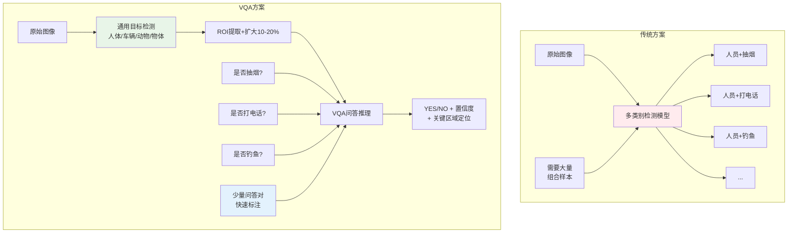

## SpeedVQA全栈系统架构

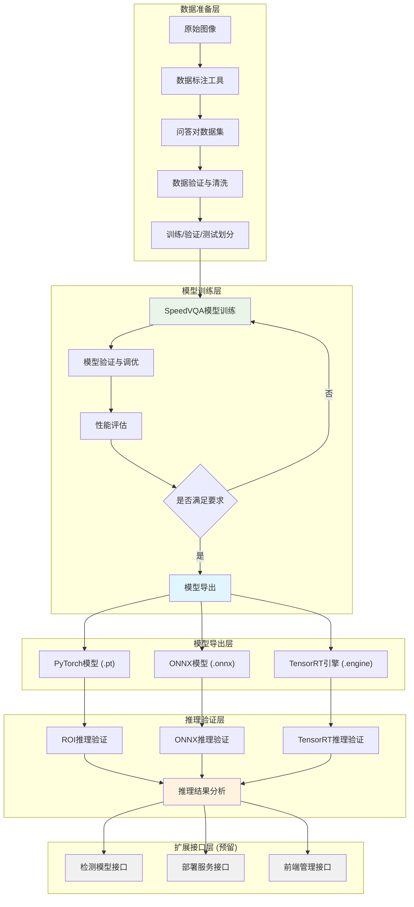

## 术语表

- **VQA_System**: 视觉问答系统主体
- **SpeedVQA_Trainer**: 模型训练器（支持独立训练和验证）
- **Model_Exporter**: 模型导出器（支持.pt/.onnx/.engine格式）
- **Deployment_Manager**: 部署管理器（支持多种部署方案）
- **ROI_Tester**: ROI测试模式（直接输入ROI图像测试）
- **Detection_Pipeline**: 全图检测链路（对接外部检测模型）
- **Custom_Solution**: 自定义解决方案（客户定制部署）
- **ROI_Inferencer**: ROI推理器（对ROI图像进行问答推理）
- **Performance_Monitor**: 性能监控器（推理时间、准确率统计）
- **Result_Visualizer**: 结果可视化器（推理结果展示）
- **Online_Annotator**: 客户现场在线标注工具
- **Online_Learner**: 客户现场在线学习模块
- **ROI_Merger**: ROI区域合并模块（处理群体目标）
- **ROI_Extractor**: 自适应ROI提取器（根据场景调整策略）
- **Question_Analyzer**: 问题复杂度分析器
- **Binary_Classifier**: 二分类VQA模型
- **Multi_Classifier**: 多分类共享VQA模型
- **Grouped_Classifier**: 按类型分组的VQA模型
- **Confidence_Scorer**: 置信度评分器
- **Region_Localizer**: 关键区域定位器
- **Performance_Analyzer**: 性能分析器（混淆矩阵、ROC曲线等）

## 需求

### 需求 1: 独立数据准备与标注

**用户故事:** 作为数据工程师，我希望系统提供完整的数据准备工具链，支持高效的问答对标注和数据质量管理。

#### 验收标准

1. WHEN 原始图像输入 THEN Data_Annotator SHALL 提供直观的ROI标注界面
2. WHEN ROI标注完成 THEN Data_Annotator SHALL 支持问答对快速标注
3. WHEN 标注数据生成 THEN Data_Validator SHALL 自动检测标注质量和一致性
4. WHEN 数据集划分 THEN Data_Splitter SHALL 按7:2:1比例划分训练/验证/测试集
5. WHEN 数据导出 THEN Data_Exporter SHALL 生成标准格式的训练数据

### 需求 2: 独立模型训练系统

**用户故事:** 作为算法工程师，我希望能够独立训练SpeedVQA模型，支持超参数调优和性能监控。

#### 验收标准

1. WHEN 训练数据准备完成 THEN SpeedVQA_Trainer SHALL 支持独立模型训练
2. WHEN 训练过程执行 THEN SpeedVQA_Trainer SHALL 提供实时训练监控和日志
3. WHEN 验证阶段 THEN SpeedVQA_Trainer SHALL 自动评估模型性能指标
4. WHEN 训练完成 THEN SpeedVQA_Trainer SHALL 生成详细的训练报告
5. WHEN 超参数调优 THEN SpeedVQA_Trainer SHALL 支持网格搜索和贝叶斯优化

### 需求 3: 多格式模型导出

**用户故事:** 作为部署工程师，我希望系统支持多种模型格式导出，满足不同部署环境的需求。

#### 验收标准

1. WHEN 模型训练完成 THEN Model_Exporter SHALL 支持PyTorch(.pt)格式导出
2. WHEN ONNX导出需要 THEN Model_Exporter SHALL 支持ONNX(.onnx)格式导出
3. WHEN TensorRT优化需要 THEN Model_Exporter SHALL 支持TensorRT(.engine)格式导出
4. WHEN 模型导出 THEN Model_Exporter SHALL 验证导出模型的功能一致性
5. WHEN 性能测试 THEN Model_Exporter SHALL 提供各格式的性能基准测试

### 需求 4: 灵活部署方案

**用户故事:** 作为系统集成商，我希望系统提供多种部署方案，适应不同的业务场景和技术栈。

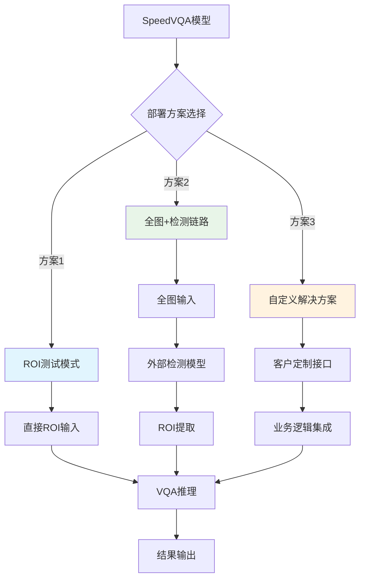

#### 验收标准

1. WHEN ROI测试需要 THEN ROI_Tester SHALL 支持直接输入ROI图像进行测试
2. WHEN 全图检测需要 THEN Detection_Pipeline SHALL 对接外部检测模型完成全链路
3. WHEN 自定义部署需要 THEN Custom_Solution SHALL 提供灵活的API接口
4. WHEN 部署配置 THEN Deployment_Manager SHALL 支持配置文件驱动的部署管理
5. WHEN 性能监控 THEN Deployment_Manager SHALL 提供实时性能监控和告警

### 需求 5: T4性能优化与基准测试

**用户故事:** 作为性能工程师，我希望SpeedVQA模型在T4显卡上实现毫秒级推理性能，满足实时应用需求。

#### 验收标准

1. WHEN 模型推理执行 THEN Performance_Monitor SHALL 记录单次推理延迟
2. WHEN 批量推理执行 THEN Performance_Monitor SHALL 统计平均吞吐量
3. WHEN TensorRT优化启用 THEN Model_Exporter SHALL 将推理速度提升至少50%
4. WHEN T4显卡部署 THEN ROI_Inferencer SHALL 实现单次推理<50ms的目标
5. WHEN 性能基准测试 THEN Performance_Monitor SHALL 生成详细的性能报告

### 需求 6: ROI推理验证系统

**用户故事:** 作为算法工程师，我希望能够使用训练好的SpeedVQA模型对ROI图片进行问答推理，验证模型的实际效果。

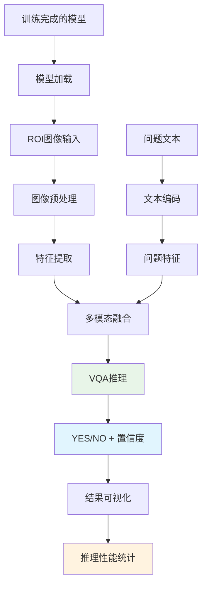

#### 验收标准

1. WHEN 模型训练完成 THEN ROI_Inferencer SHALL 支持加载训练好的SpeedVQA模型
2. WHEN ROI图像输入 THEN ROI_Inferencer SHALL 对单张ROI图像进行问答推理
3. WHEN 批量推理需要 THEN ROI_Inferencer SHALL 支持批量ROI图像的高效推理
4. WHEN 推理完成 THEN ROI_Inferencer SHALL 输出YES/NO答案、置信度和推理时间
5. WHEN 结果验证 THEN ROI_Inferencer SHALL 提供推理结果的可视化展示

### 需求 3: 增强输出信息

**用户故事:** 作为业务用户，我希望系统不仅提供YES/NO答案，还能提供置信度和关键区域定位，便于结果验证和误报分析。

#### 验收标准

1. WHEN VQA推理完成 THEN Confidence_Scorer SHALL 输出0-1范围的置信度分数
2. WHEN 答案为YES THEN Region_Localizer SHALL 定位ROI内的关键区域坐标
3. WHEN 置信度低于阈值 THEN VQA_System SHALL 标记为"不确定"状态
4. WHEN 关键区域定位失败 THEN Region_Localizer SHALL 返回整个ROI区域
5. WHEN 输出结果生成 THEN VQA_System SHALL 包含答案、置信度、关键区域三项信息

### 需求 4: 垂直行业快速适配

**用户故事:** 作为行业客户，我希望系统能够快速适配新的垂直行业需求，通过增加问答对而非重新训练检测模型。

#### 验收标准

1. WHEN 新行业需求出现 THEN VQA_System SHALL 支持添加新问答对而不影响基础检测
2. WHEN 问答对数据准备完成 THEN VQA_System SHALL 支持增量训练新问题类型
3. WHEN 同一需求出现误报漏报 THEN VQA_System SHALL 支持针对性样本增强
4. WHEN 多个垂直行业并存 THEN VQA_System SHALL 支持问题路由和批量处理
5. WHEN 行业需求变更 THEN VQA_System SHALL 提供快速模型切换能力

### 需求 5: 独立模块优化与调试

**用户故事:** 作为算法团队，我希望能够独立优化每个检测模型和VQA模型，实现专业分工、易于调试和持续改进。

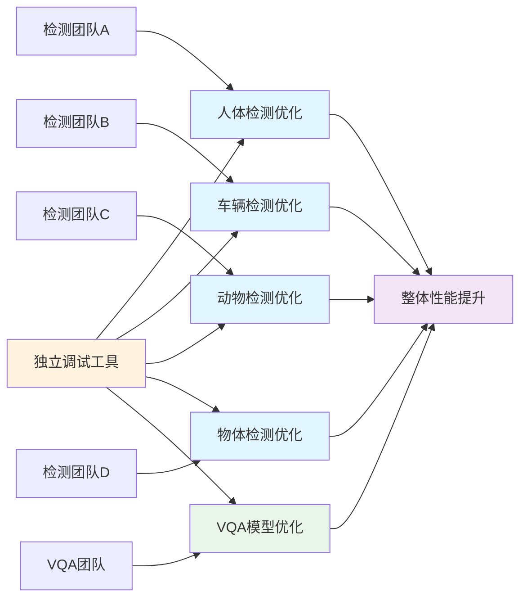

#### 验收标准

1. WHEN 任一基础检测模型更新 THEN VQA_System SHALL 支持独立部署而不影响其他模块
2. WHEN VQA模型优化 THEN VQA_System SHALL 保持与所有检测模块的接口兼容
3. WHEN 模块调试需要 THEN VQA_System SHALL 提供每个模块的独立性能监控
4. WHEN 团队分工协作 THEN VQA_System SHALL 提供标准化的模块接口和调试工具
5. WHEN 版本管理需要 THEN VQA_System SHALL 支持每个模块的独立版本控制

### 需求 6: 端到端性能优化

**用户故事:** 作为系统管理员，我希望整个系统在T4显卡上实现极速响应，满足实时监控的性能要求。

#### 验收标准

1. WHEN 完整的VQA流程执行 THEN VQA_System SHALL 在100ms内完成端到端推理
2. WHEN 系统处理批量请求 THEN VQA_System SHALL 实现超过100FPS的吞吐量
3. WHEN 使用TensorRT优化 THEN VQA_System SHALL 将推理速度提升至少50%
4. WHEN GPU内存使用超过80% THEN VQA_System SHALL 触发内存优化策略
5. WHEN 多问题并行处理 THEN VQA_System SHALL 实现高效的批处理机制

### 需求 7: 智能数据标注

**用户故事:** 作为数据标注员，我希望系统能够智能化地处理问答对标注，减少重复工作并提高标注质量。

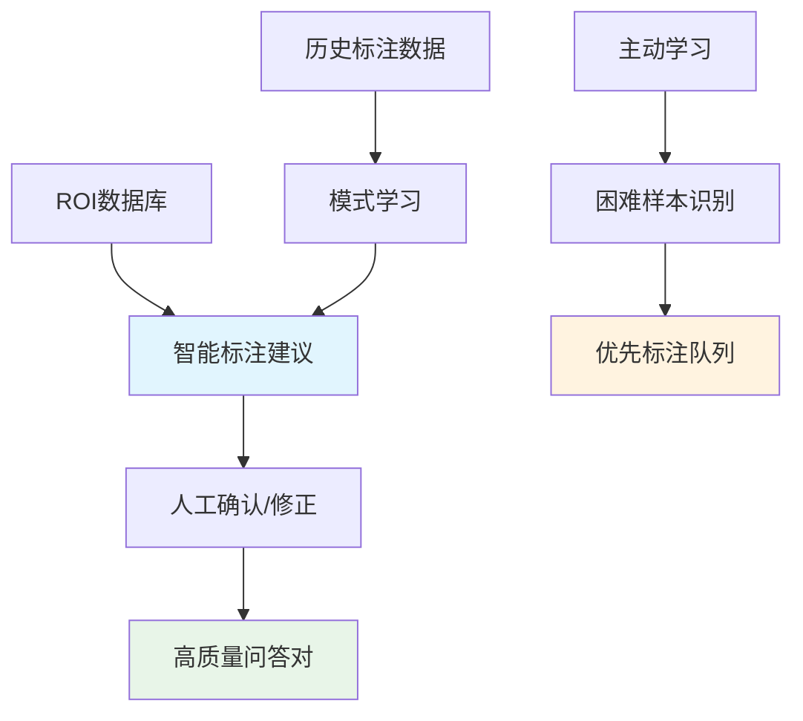

#### 验收标准

1. WHEN ROI数据输入 THEN VQA_System SHALL 基于历史数据提供标注建议
2. WHEN 标注建议生成 THEN VQA_System SHALL 标明建议的置信度水平
3. WHEN 困难样本识别 THEN VQA_System SHALL 优先推荐需要人工标注的样本
4. WHEN 标注质量检查 THEN VQA_System SHALL 自动检测标注不一致性
5. WHEN 批量标注完成 THEN VQA_System SHALL 生成标注质量报告

### 需求 8: 详细性能分析

**用户故事:** 作为算法工程师，我希望系统提供详细的性能分析工具，包括混淆矩阵、ROC曲线等，用于模型优化和问题诊断。

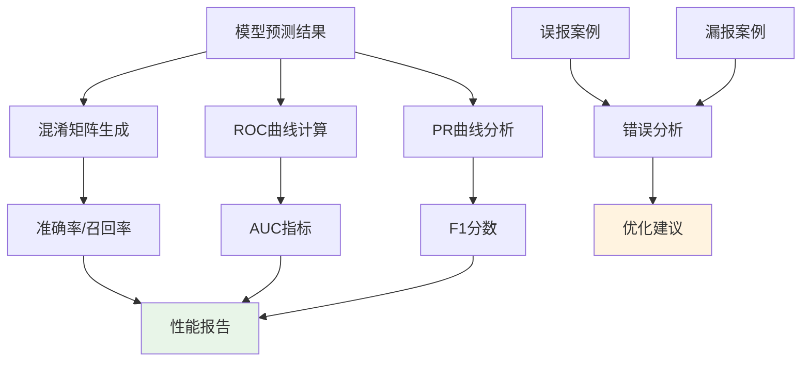

#### 验收标准

1. WHEN 模型评估运行 THEN Performance_Analyzer SHALL 生成详细的混淆矩阵
2. WHEN ROC分析执行 THEN Performance_Analyzer SHALL 计算AUC值和最优阈值
3. WHEN 错误案例分析 THEN Performance_Analyzer SHALL 分类误报和漏报原因
4. WHEN 性能对比需要 THEN Performance_Analyzer SHALL 支持多模型性能对比
5. WHEN 报告生成完成 THEN Performance_Analyzer SHALL 提供可视化的性能仪表板

### 需求 9: 模型部署与服务化

**用户故事:** 作为运维工程师，我希望系统能够稳定部署并提供可靠的API服务，支持生产环境的高并发访问。

#### 验收标准

1. WHEN 模型部署请求发起 THEN VQA_System SHALL 加载TensorRT优化的所有模型组件
2. WHEN API请求到达 THEN VQA_System SHALL 提供RESTful接口支持批量问答
3. WHEN 服务启动 THEN VQA_System SHALL 进行模型预热和健康检查
4. WHEN 并发请求超过阈值 THEN VQA_System SHALL 实施智能负载均衡
5. WHEN 服务异常 THEN VQA_System SHALL 自动重启并保存错误上下文

### 需求 10: 客户现场在线学习

**用户故事:** 作为现场部署工程师，我希望系统能够在客户现场进行在线标注和学习，快速适应新的垂直需求而无需返回总部重新训练。

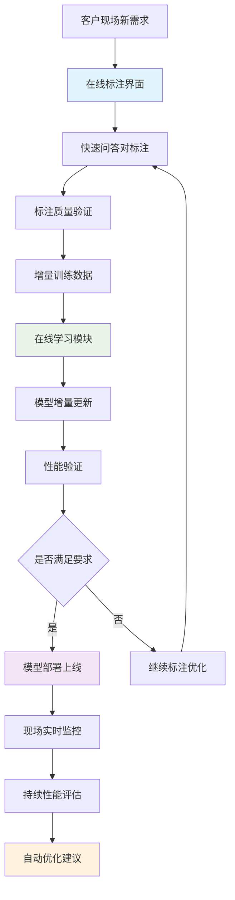

#### 验收标准

1. WHEN 客户现场出现新需求 THEN Online_Annotator SHALL 提供简化的标注界面
2. WHEN 标注数据达到最小阈值 THEN Online_Learner SHALL 启动增量训练流程
3. WHEN 在线训练完成 THEN Online_Learner SHALL 自动验证模型性能
4. WHEN 模型性能满足要求 THEN VQA_System SHALL 支持热更新部署
5. WHEN 现场调试需要 THEN VQA_System SHALL 提供详细的调试日志和可视化工具

### 需求 12: 智能ROI合并与群体目标处理

**用户故事:** 作为算法工程师，我希望系统能够智能处理群体目标场景，通过ROI合并策略优化多人互动行为的检测效果。

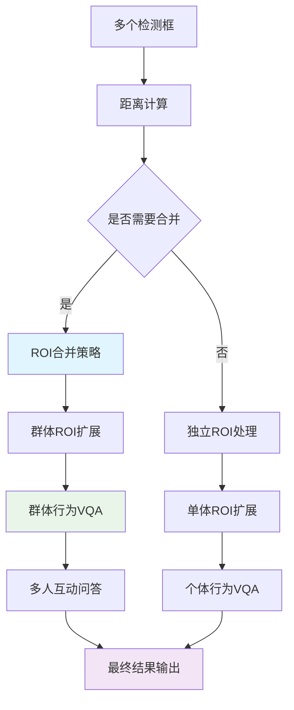

#### 验收标准

1. WHEN 检测到多个相邻人体目标 THEN ROI_Merger SHALL 计算目标间距离和重叠度
2. WHEN 目标间距离小于阈值 THEN ROI_Merger SHALL 合并为群体ROI并扩展边界
3. WHEN 群体ROI生成 THEN VQA_System SHALL 支持群体行为问答（如"是否有人员打架？"）
4. WHEN 单独目标检测 THEN ROI_Expander SHALL 按标准策略扩展10-20%边界
5. WHEN ROI合并策略执行 THEN VQA_System SHALL 同时保留个体和群体两种分析结果

### 需求 13: 复杂行为VQA问答

**用户故事:** 作为业务用户，我希望系统能够通过VQA方式处理传统检测难以解决的复杂行为识别，如人员打架、异常聚集等。

#### 验收标准

1. WHEN 输入复杂行为问题 THEN VQA_System SHALL 支持多人互动行为问答
2. WHEN 问题涉及"人员打架" THEN VQA_System SHALL 分析群体ROI中的动作特征
3. WHEN 问题涉及"异常聚集" THEN VQA_System SHALL 评估人员密度和分布模式
4. WHEN 问题涉及"危险行为" THEN VQA_System SHALL 结合个体和环境上下文分析
5. WHEN 复杂行为检测完成 THEN VQA_System SHALL 提供行为置信度和关键证据区域

### 需求 14: 自适应ROI提取策略

**用户故事:** 作为算法工程师，我希望系统能够根据不同场景和目标类型，自适应地调整ROI提取策略，优化问答效果。

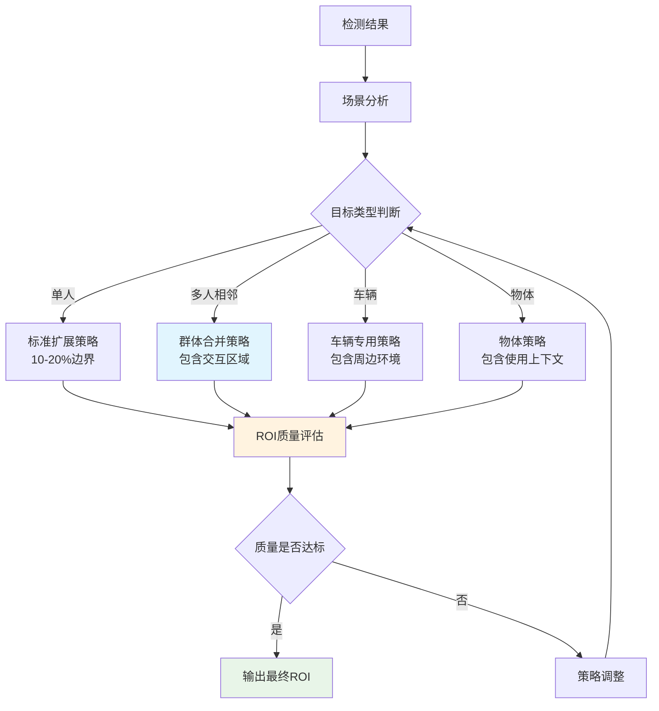

#### 验收标准

1. WHEN 检测单个目标 THEN ROI_Extractor SHALL 应用标准10-20%边界扩展
2. WHEN 检测多个相邻目标 THEN ROI_Extractor SHALL 应用群体合并策略
3. WHEN 目标为车辆类型 THEN ROI_Extractor SHALL 包含周边道路环境信息
4. WHEN 目标为物体类型 THEN ROI_Extractor SHALL 包含使用上下文和人物交互
5. WHEN ROI质量不达标 THEN ROI_Extractor SHALL 自动调整提取策略并重新处理

### 需求 15: 属性识别扩展能力

**用户故事:** 作为产品经理，我希望系统具备属性识别扩展能力，支持人体属性、车辆属性等细粒度特征识别，为后续高级应用奠定基础。

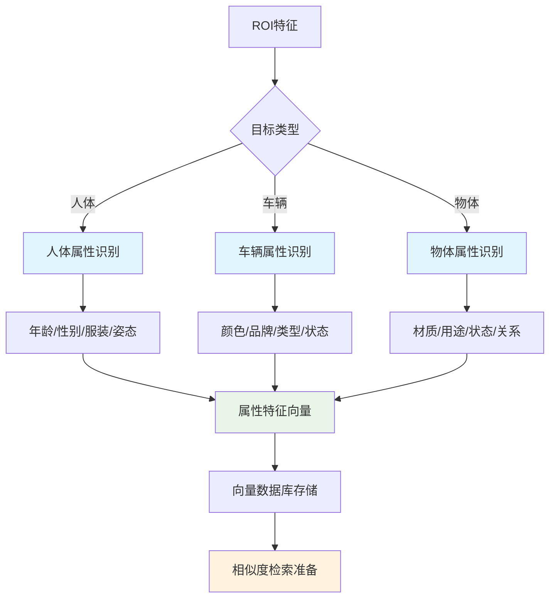

#### 验收标准

1. WHEN 人体ROI输入 THEN Attribute_Recognizer SHALL 识别年龄、性别、服装、姿态等属性
2. WHEN 车辆ROI输入 THEN Attribute_Recognizer SHALL 识别颜色、品牌、类型、状态等属性
3. WHEN 物体ROI输入 THEN Attribute_Recognizer SHALL 识别材质、用途、状态等属性
4. WHEN 属性识别完成 THEN Feature_Vectorizer SHALL 生成标准化特征向量
5. WHEN 特征向量生成 THEN Vector_Database SHALL 支持高效存储和索引

### 需求 16: 向量搜索与检索能力

**用户故事:** 作为业务用户，我希望系统支持以图搜图和语义搜索功能，能够快速检索相似目标和语义相关内容。

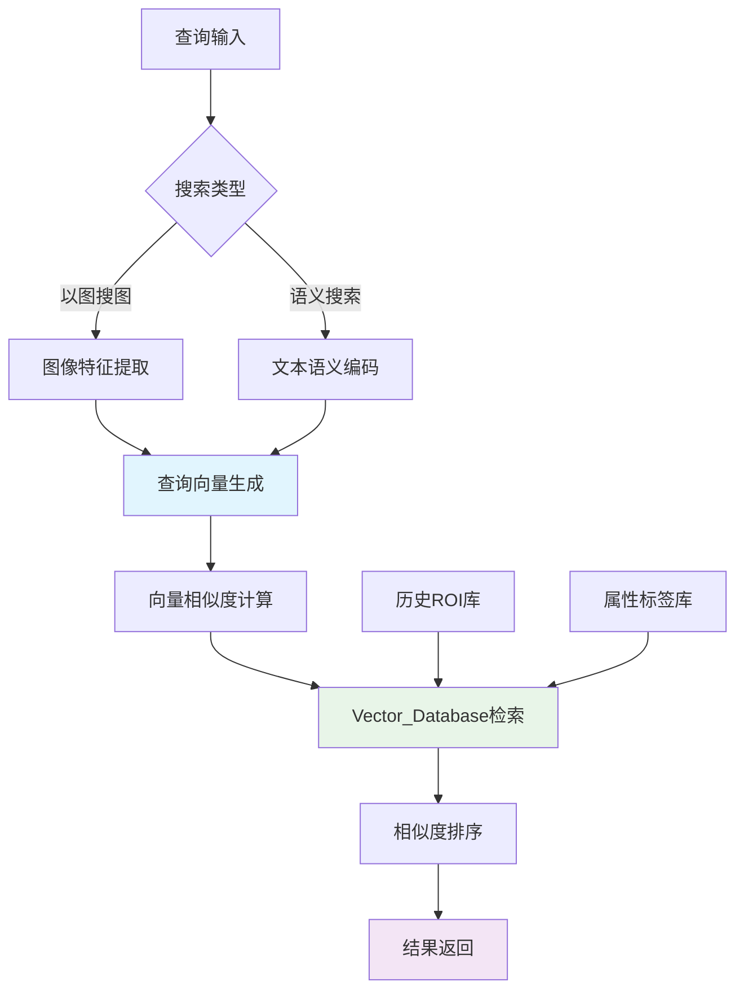

#### 验收标准

1. WHEN 用户上传查询图像 THEN Image_Searcher SHALL 提取图像特征向量
2. WHEN 用户输入语义查询 THEN Semantic_Searcher SHALL 编码文本语义向量
3. WHEN 向量检索执行 THEN Vector_Database SHALL 返回Top-K相似结果
4. WHEN 搜索结果生成 THEN VQA_System SHALL 提供相似度分数和原始ROI信息
5. WHEN 检索性能要求 THEN Vector_Database SHALL 支持毫秒级向量检索响应

### 需求 17: 分阶段扩展路线图

**用户故事:** 作为项目经理，我希望系统按照优先级分阶段实施，确保核心功能优先交付，扩展功能有序推进。

#### 验收标准

1. WHEN Phase 1实施 THEN VQA_System SHALL 优先完成L2 VQA问答层核心功能
2. WHEN Phase 1验收通过 THEN VQA_System SHALL 启动L3属性识别层开发
3. WHEN Phase 2完成 THEN VQA_System SHALL 具备基础属性识别和向量化能力
4. WHEN Phase 3规划 THEN VQA_System SHALL 设计L4向量搜索层详细方案
5. WHEN 各阶段交付 THEN VQA_System SHALL 保持向后兼容和平滑升级
### 需求 11: 持续学习与优化

**用户故事:** 作为产品经理，我希望系统具备持续学习能力，能够从生产环境的反馈中不断优化模型性能。

#### 验收标准

1. WHEN 生产数据积累 THEN VQA_System SHALL 定期分析模型性能趋势
2. WHEN 性能下降检测 THEN VQA_System SHALL 触发模型重训练流程
3. WHEN 新样本收集 THEN VQA_System SHALL 支持在线学习和模型更新
4. WHEN A/B测试需要 THEN VQA_System SHALL 支持多版本模型并行部署
5. WHEN 优化完成 THEN VQA_System SHALL 提供模型性能改进报告

## 分阶段实施优先级

### Phase 1: 核心训练系统 (优先级: 最高) 🎯
**目标：确保SpeedVQA模型能够成功训练**
- 数据准备与标注工具
- SpeedVQA模型训练系统（MobileNetV3 + DistilBERT + MLP）
- 训练监控和验证
- 模型性能评估
- 基础数据增强和优化

### Phase 2: 推理验证系统 (优先级: 高) 🚀
**目标：确保训练的模型能够对ROI图片进行问答推理**
- 模型导出(.pt/.onnx/.engine)
- ROI图像推理验证
- 推理性能优化(TensorRT)
- T4显卡性能基准测试
- 推理结果可视化

### Phase 3: 部署集成方案 (优先级: 中) 🔧
**目标：支持多种部署方案和外部系统集成**
- 全图+检测链路集成
- 自定义解决方案接口
- 配置文件驱动的部署
- 批量推理支持

### Phase 4: 服务化系统 (优先级: 低) 🌐
**目标：完整的前后端服务系统**
- FastAPI后端服务
- React/Vue前端界面
- 用户反馈收集
- 在线学习机制
- 企业级管理功能

### 当前阶段重点
**Phase 1 + Phase 2**：专注于训练和推理的核心能力，确保技术可行性和性能达标，为后续服务化奠定坚实基础。

## 扩展性接口设计

### 核心接口规范

```python
# 1. 数据接口 - 支持多种数据源
class DataInterface:
    def load_dataset(self, data_path: str) -> Dataset
    def validate_annotations(self, annotations: List[Dict]) -> bool
    def export_format(self, format_type: str) -> Dict

# 2. 模型接口 - 支持模型热插拔
class ModelInterface:
    def load_model(self, model_path: str, format: str) -> Model
    def inference(self, roi_image: np.ndarray, question: str) -> Dict
    def batch_inference(self, batch_data: List[Tuple]) -> List[Dict]

# 3. 部署接口 - 支持多种部署方案
class DeploymentInterface:
    def setup_roi_mode(self, config: Dict) -> None
    def setup_detection_pipeline(self, detector_config: Dict) -> None
    def setup_custom_solution(self, custom_config: Dict) -> None

# 4. 扩展接口 - 预留未来功能
class ExtensionInterface:
    def register_detector(self, detector: Any) -> None
    def register_attribute_recognizer(self, recognizer: Any) -> None
    def register_feedback_collector(self, collector: Any) -> None
```

### 配置驱动的扩展性

```yaml
# speedvqa_config.yaml - 统一配置文件
system:
  mode: "training"  # training, inference, deployment
  
data:
  source_type: "local"  # local, remote, database
  annotation_format: "coco"  # coco, yolo, custom
  
model:
  architecture: "speedvqa"
  backbone: "mobilenet_v3_small"
  text_encoder: "distilbert-base-uncased"
  
deployment:
  mode: "roi_test"  # roi_test, detection_pipeline, custom
  optimization: "tensorrt"  # pytorch, onnx, tensorrt
  
extensions:
  enable_attributes: false
  enable_vector_search: false
  enable_online_learning: false
```

### 模块化组件设计

- **核心模块**：训练、推理、导出（必需）
- **扩展模块**：检测对接、属性识别、向量搜索（可选）
- **服务模块**：前后端、API、管理界面（独立）
- **接口模块**：标准化接口、配置管理（通用）