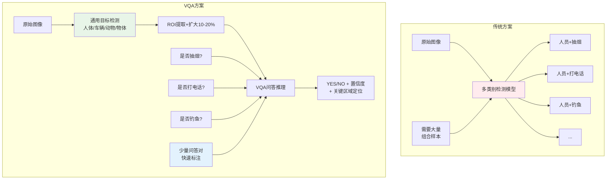
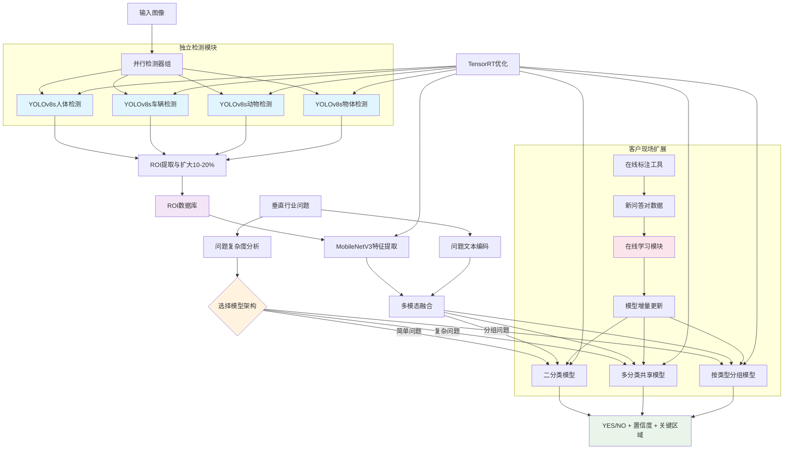
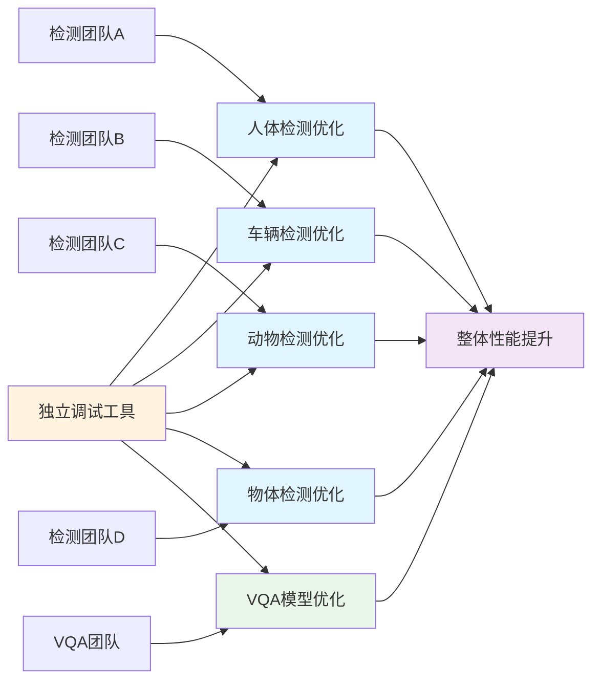
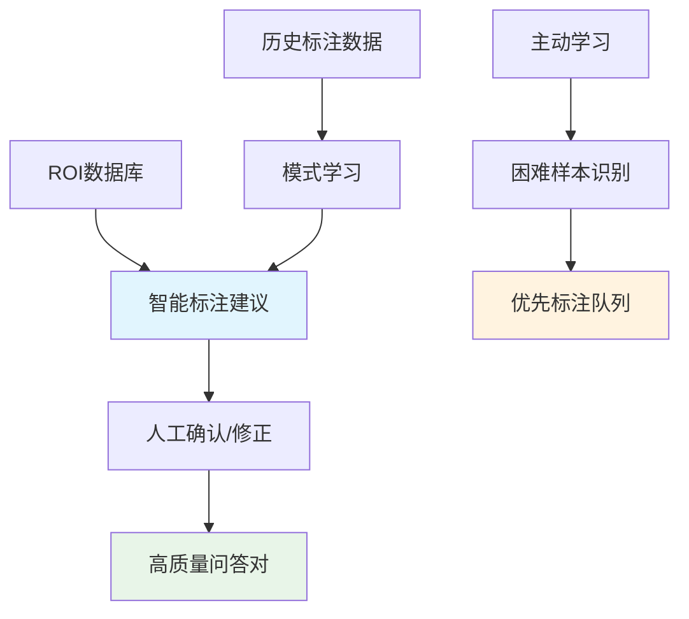
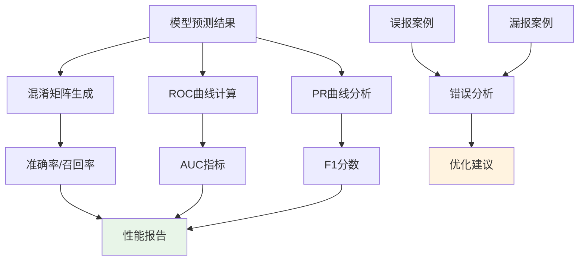
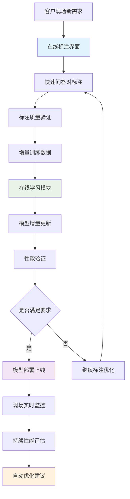

# 需求文档

## 介绍

基于目标检测的极速视觉问答系统是一个创新的垂直行业AI解决方案，通过VQA技术替代传统多类别检测方法。系统采用**解耦式两阶段架构**：通用目标检测→专业问答推理，专门针对T4显卡优化，实现毫秒级响应。相比传统方法需要为每个行为准备大量样本，本方案通过问答对的方式大幅降低数据标注成本，快速适应垂直行业需求。

## 创新方案对比

## 独立模块化架构设计

## 术语表

- **VQA_System**: 视觉问答系统主体
- **Human_Detector**: 独立的人体检测模型
- **Vehicle_Detector**: 独立的车辆检测模型  
- **Animal_Detector**: 独立的动物检测模型
- **Object_Detector**: 独立的物体检测模型
- **Online_Annotator**: 客户现场在线标注工具
- **Online_Learner**: 客户现场在线学习模块
- **ROI_Expander**: ROI区域扩大模块（10-20%扩展）
- **Question_Analyzer**: 问题复杂度分析器
- **Binary_Classifier**: 二分类VQA模型
- **Multi_Classifier**: 多分类共享VQA模型
- **Grouped_Classifier**: 按类型分组的VQA模型
- **Confidence_Scorer**: 置信度评分器
- **Region_Localizer**: 关键区域定位器
- **Performance_Analyzer**: 性能分析器（混淆矩阵、ROC曲线等）

## 需求

### 需求 1: 独立基础检测模块

**用户故事:** 作为算法工程师，我希望每个基础目标类别都有独立的检测模型，便于单独优化、调试和扩展。

#### 验收标准

1. WHEN 输入图像到系统 THEN Human_Detector SHALL 独立检测人体目标
2. WHEN 输入图像到系统 THEN Vehicle_Detector SHALL 独立检测车辆目标  
3. WHEN 输入图像到系统 THEN Animal_Detector SHALL 独立检测动物目标
4. WHEN 输入图像到系统 THEN Object_Detector SHALL 独立检测物体目标
5. WHEN 任一检测器需要优化 THEN VQA_System SHALL 支持单独模型更新而不影响其他检测器

### 需求 2: 动态VQA模型架构

**用户故事:** 作为算法工程师，我希望系统能够根据问题复杂度动态选择最适合的模型架构，平衡准确性和效率。

#### 验收标准

1. WHEN 问题输入系统 THEN Question_Analyzer SHALL 分析问题复杂度和类型
2. WHEN 问题为简单二分类 THEN VQA_System SHALL 使用独立的Binary_Classifier
3. WHEN 多个问题可共享特征 THEN VQA_System SHALL 使用Multi_Classifier
4. WHEN 问题按类型分组 THEN VQA_System SHALL 使用对应的Grouped_Classifier
5. WHEN 模型架构切换 THEN VQA_System SHALL 保持接口一致性

### 需求 3: 增强输出信息

**用户故事:** 作为业务用户，我希望系统不仅提供YES/NO答案，还能提供置信度和关键区域定位，便于结果验证和误报分析。

#### 验收标准

1. WHEN VQA推理完成 THEN Confidence_Scorer SHALL 输出0-1范围的置信度分数
2. WHEN 答案为YES THEN Region_Localizer SHALL 定位ROI内的关键区域坐标
3. WHEN 置信度低于阈值 THEN VQA_System SHALL 标记为"不确定"状态
4. WHEN 关键区域定位失败 THEN Region_Localizer SHALL 返回整个ROI区域
5. WHEN 输出结果生成 THEN VQA_System SHALL 包含答案、置信度、关键区域三项信息

### 需求 4: 垂直行业快速适配

**用户故事:** 作为行业客户，我希望系统能够快速适配新的垂直行业需求，通过增加问答对而非重新训练检测模型。

#### 验收标准

1. WHEN 新行业需求出现 THEN VQA_System SHALL 支持添加新问答对而不影响基础检测
2. WHEN 问答对数据准备完成 THEN VQA_System SHALL 支持增量训练新问题类型
3. WHEN 同一需求出现误报漏报 THEN VQA_System SHALL 支持针对性样本增强
4. WHEN 多个垂直行业并存 THEN VQA_System SHALL 支持问题路由和批量处理
5. WHEN 行业需求变更 THEN VQA_System SHALL 提供快速模型切换能力

### 需求 5: 独立模块优化与调试

**用户故事:** 作为算法团队，我希望能够独立优化每个检测模型和VQA模型，实现专业分工、易于调试和持续改进。

#### 验收标准

1. WHEN 任一基础检测模型更新 THEN VQA_System SHALL 支持独立部署而不影响其他模块
2. WHEN VQA模型优化 THEN VQA_System SHALL 保持与所有检测模块的接口兼容
3. WHEN 模块调试需要 THEN VQA_System SHALL 提供每个模块的独立性能监控
4. WHEN 团队分工协作 THEN VQA_System SHALL 提供标准化的模块接口和调试工具
5. WHEN 版本管理需要 THEN VQA_System SHALL 支持每个模块的独立版本控制

### 需求 6: 端到端性能优化

**用户故事:** 作为系统管理员，我希望整个系统在T4显卡上实现极速响应，满足实时监控的性能要求。

#### 验收标准

1. WHEN 完整的VQA流程执行 THEN VQA_System SHALL 在100ms内完成端到端推理
2. WHEN 系统处理批量请求 THEN VQA_System SHALL 实现超过100FPS的吞吐量
3. WHEN 使用TensorRT优化 THEN VQA_System SHALL 将推理速度提升至少50%
4. WHEN GPU内存使用超过80% THEN VQA_System SHALL 触发内存优化策略
5. WHEN 多问题并行处理 THEN VQA_System SHALL 实现高效的批处理机制

### 需求 7: 智能数据标注

**用户故事:** 作为数据标注员，我希望系统能够智能化地处理问答对标注，减少重复工作并提高标注质量。

#### 验收标准

1. WHEN ROI数据输入 THEN VQA_System SHALL 基于历史数据提供标注建议
2. WHEN 标注建议生成 THEN VQA_System SHALL 标明建议的置信度水平
3. WHEN 困难样本识别 THEN VQA_System SHALL 优先推荐需要人工标注的样本
4. WHEN 标注质量检查 THEN VQA_System SHALL 自动检测标注不一致性
5. WHEN 批量标注完成 THEN VQA_System SHALL 生成标注质量报告

### 需求 8: 详细性能分析

**用户故事:** 作为算法工程师，我希望系统提供详细的性能分析工具，包括混淆矩阵、ROC曲线等，用于模型优化和问题诊断。

#### 验收标准

1. WHEN 模型评估运行 THEN Performance_Analyzer SHALL 生成详细的混淆矩阵
2. WHEN ROC分析执行 THEN Performance_Analyzer SHALL 计算AUC值和最优阈值
3. WHEN 错误案例分析 THEN Performance_Analyzer SHALL 分类误报和漏报原因
4. WHEN 性能对比需要 THEN Performance_Analyzer SHALL 支持多模型性能对比
5. WHEN 报告生成完成 THEN Performance_Analyzer SHALL 提供可视化的性能仪表板

### 需求 9: 模型部署与服务化

**用户故事:** 作为运维工程师，我希望系统能够稳定部署并提供可靠的API服务，支持生产环境的高并发访问。

#### 验收标准

1. WHEN 模型部署请求发起 THEN VQA_System SHALL 加载TensorRT优化的所有模型组件
2. WHEN API请求到达 THEN VQA_System SHALL 提供RESTful接口支持批量问答
3. WHEN 服务启动 THEN VQA_System SHALL 进行模型预热和健康检查
4. WHEN 并发请求超过阈值 THEN VQA_System SHALL 实施智能负载均衡
5. WHEN 服务异常 THEN VQA_System SHALL 自动重启并保存错误上下文

### 需求 10: 客户现场在线学习

**用户故事:** 作为现场部署工程师，我希望系统能够在客户现场进行在线标注和学习，快速适应新的垂直需求而无需返回总部重新训练。

#### 验收标准

1. WHEN 客户现场出现新需求 THEN Online_Annotator SHALL 提供简化的标注界面
2. WHEN 标注数据达到最小阈值 THEN Online_Learner SHALL 启动增量训练流程
3. WHEN 在线训练完成 THEN Online_Learner SHALL 自动验证模型性能
4. WHEN 模型性能满足要求 THEN VQA_System SHALL 支持热更新部署
5. WHEN 现场调试需要 THEN VQA_System SHALL 提供详细的调试日志和可视化工具

### 需求 11: 持续学习与优化

**用户故事:** 作为产品经理，我希望系统具备持续学习能力，能够从生产环境的反馈中不断优化模型性能。

#### 验收标准

1. WHEN 生产数据积累 THEN VQA_System SHALL 定期分析模型性能趋势
2. WHEN 性能下降检测 THEN VQA_System SHALL 触发模型重训练流程
3. WHEN 新样本收集 THEN VQA_System SHALL 支持在线学习和模型更新
4. WHEN A/B测试需要 THEN VQA_System SHALL 支持多版本模型并行部署
5. WHEN 优化完成 THEN VQA_System SHALL 提供模型性能改进报告