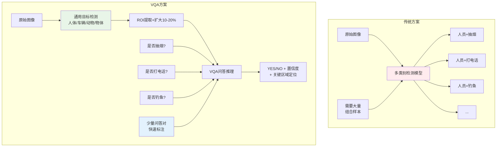
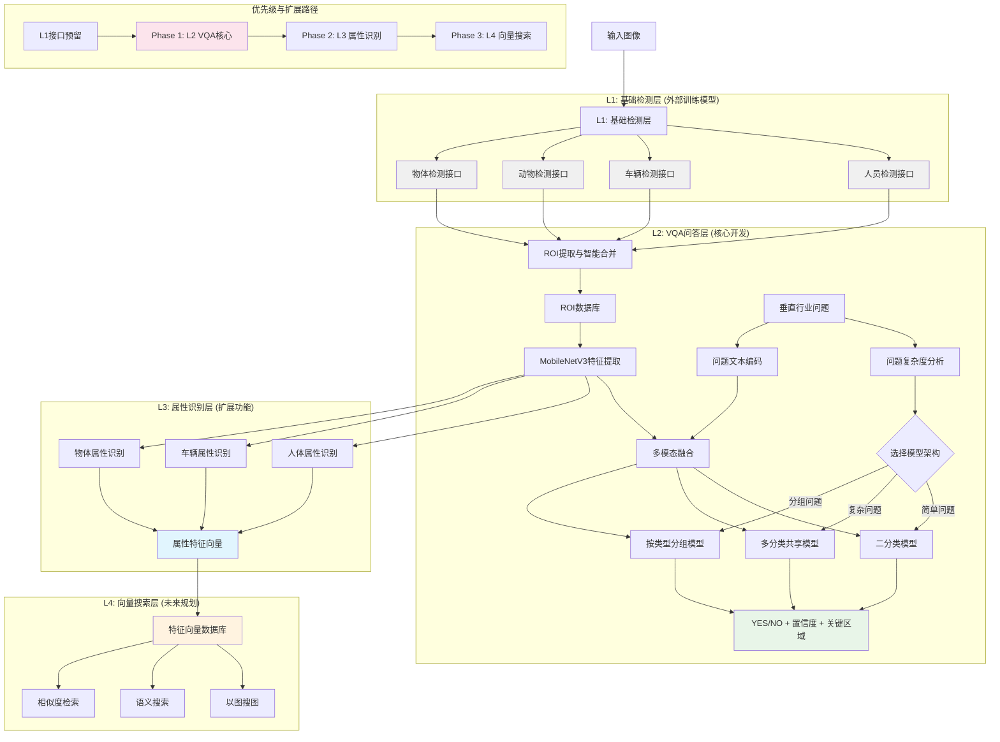
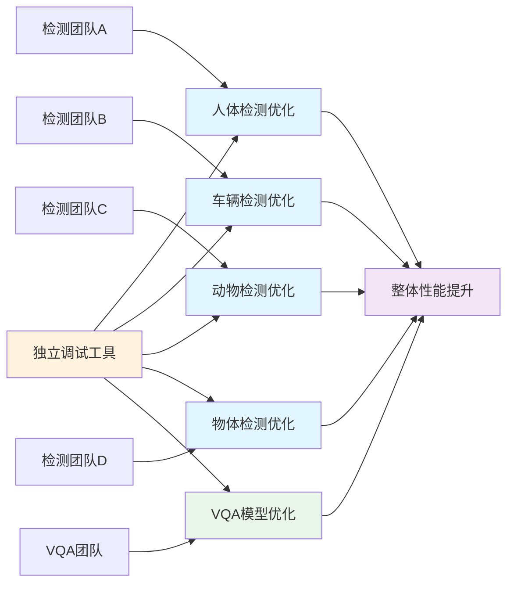
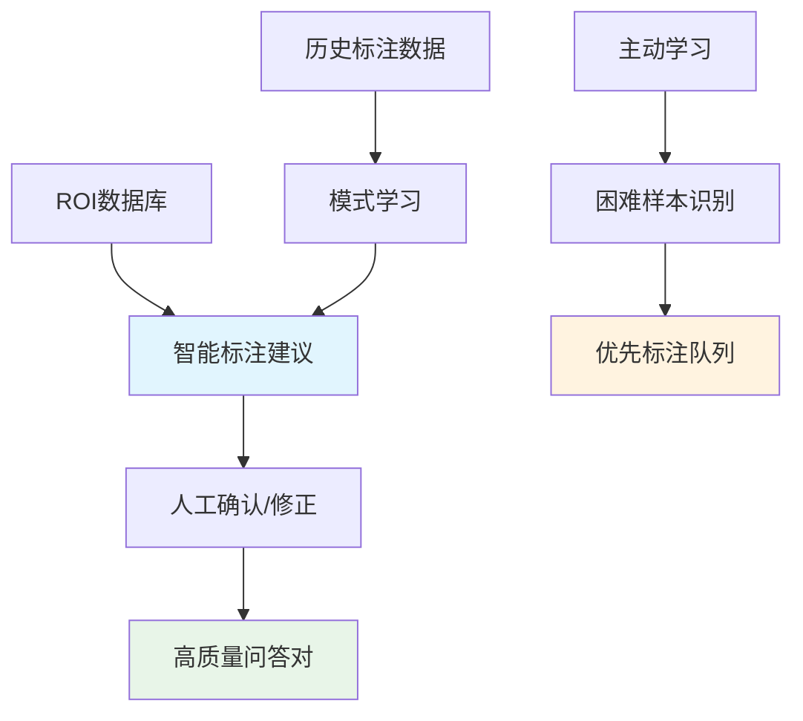
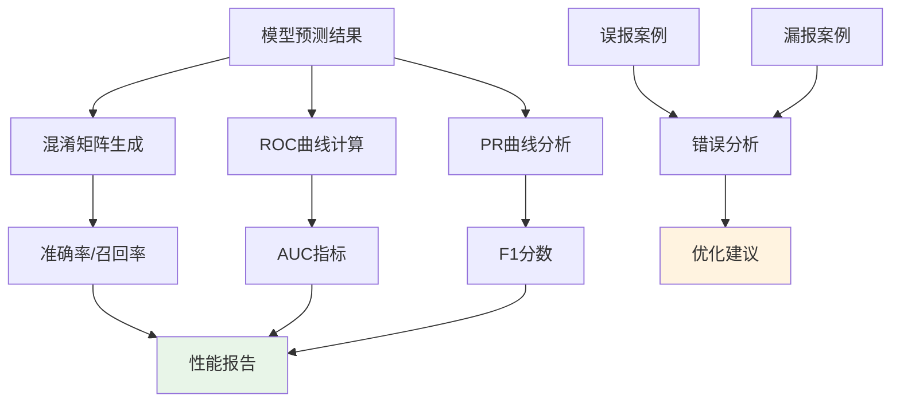
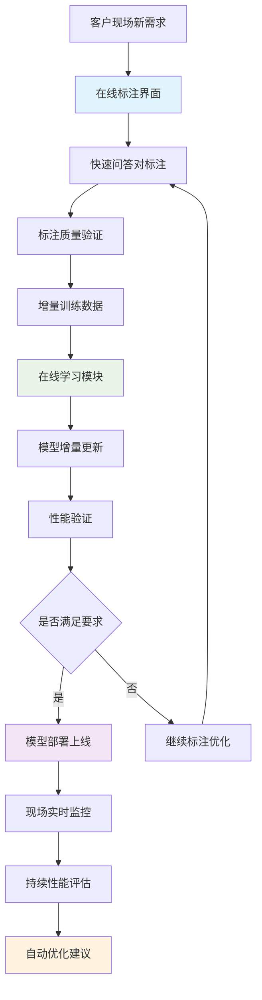
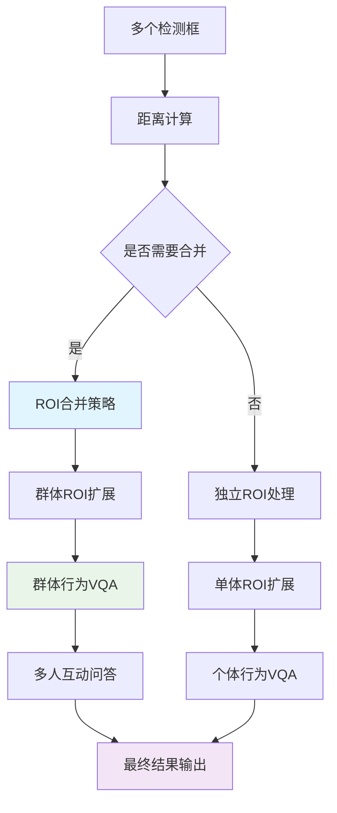
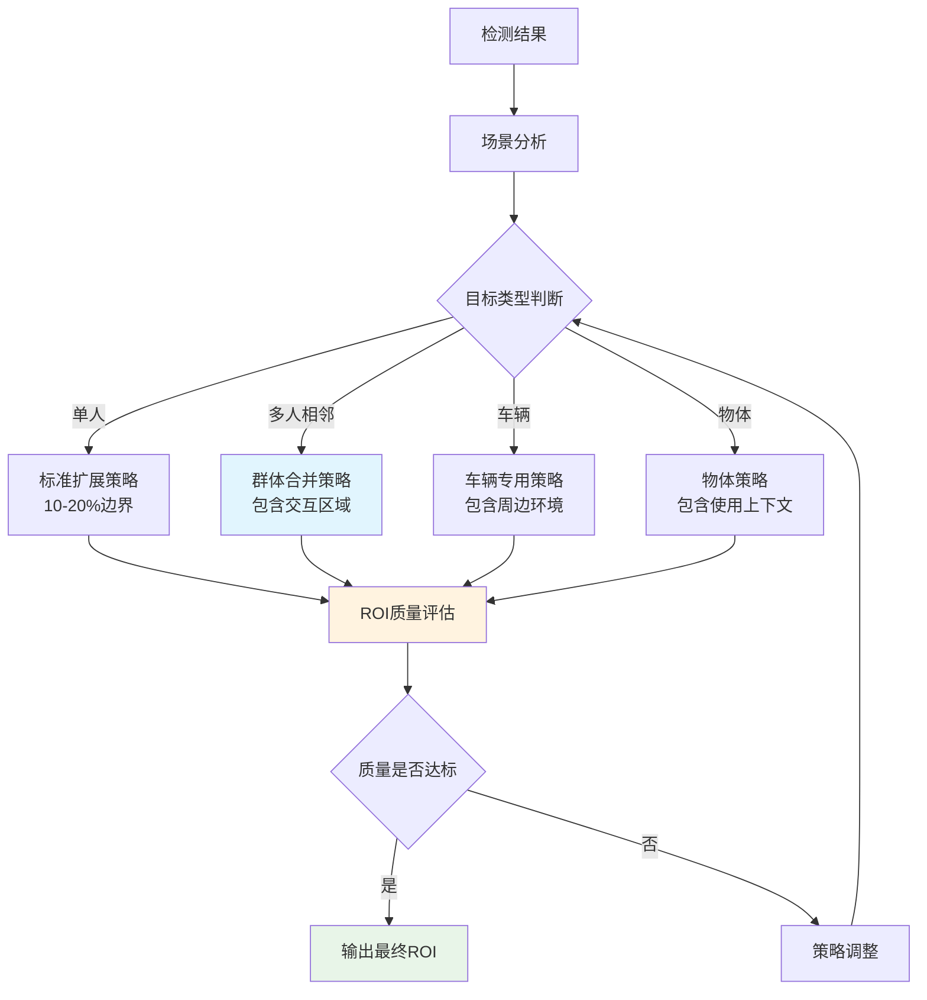
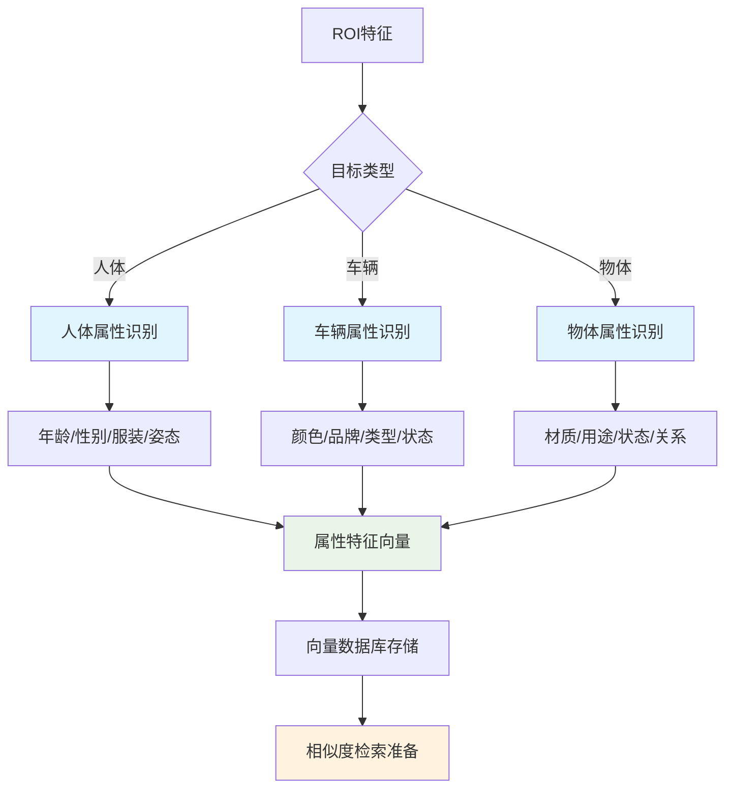
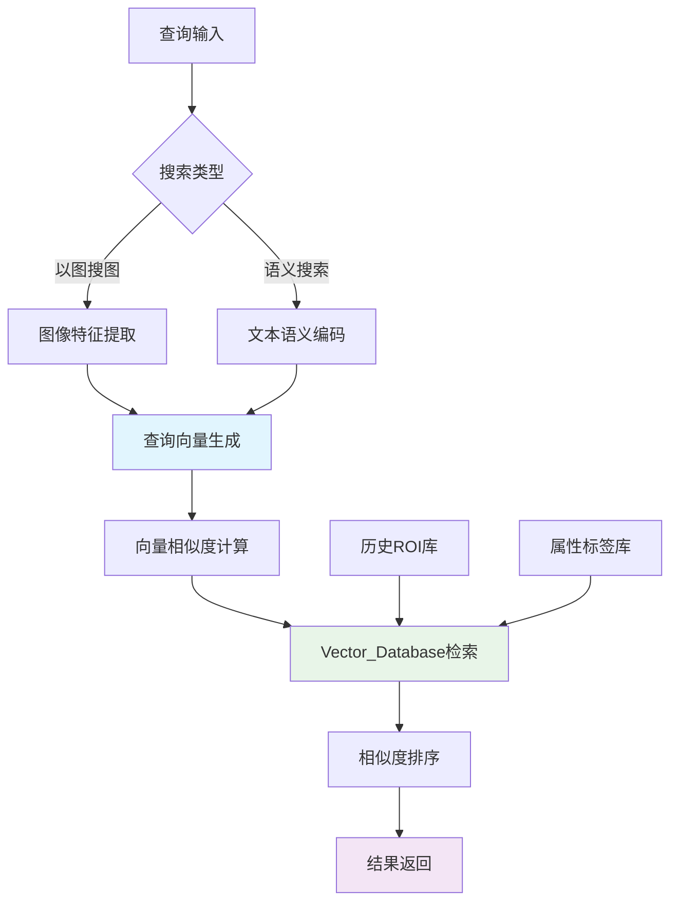

# 需求文档

## 介绍

基于目标检测的极速视觉问答系统是一个创新的垂直行业AI解决方案，通过VQA技术替代传统多类别检测方法。系统采用**分层扩展架构**：基础检测层（外部训练）→ VQA问答层（核心开发）→ 属性识别层（扩展）→ 向量搜索层（高级），专门针对T4显卡优化，实现毫秒级响应。

**架构分层设计：**
- **L1 基础检测层**：人员/车辆/动物/物体检测（外部已有，预留接口）
- **L2 VQA问答层**：核心开发重点，处理复杂行为问答
- **L3 属性识别层**：人体属性、车辆属性等细粒度特征（扩展功能）
- **L4 向量搜索层**：以图搜图、语义搜索等高级应用（未来规划）

相比传统方法需要为每个行为准备大量样本，本方案通过问答对的方式大幅降低数据标注成本，快速适应垂直行业需求。

## 创新方案对比



## 分层扩展架构设计



## 术语表

- **VQA_System**: 视觉问答系统主体
- **Detection_Interface**: 基础检测模型接口（外部训练模型的标准接口）
- **Attribute_Recognizer**: 属性识别器（人体/车辆/物体属性）
- **Feature_Vectorizer**: 特征向量化模块
- **Vector_Database**: 向量数据库（支持相似度检索）
- **Image_Searcher**: 以图搜图模块
- **Semantic_Searcher**: 语义搜索模块
- **Online_Annotator**: 客户现场在线标注工具
- **Online_Learner**: 客户现场在线学习模块
- **ROI_Merger**: ROI区域合并模块（处理群体目标）
- **ROI_Extractor**: 自适应ROI提取器（根据场景调整策略）
- **Question_Analyzer**: 问题复杂度分析器
- **Binary_Classifier**: 二分类VQA模型
- **Multi_Classifier**: 多分类共享VQA模型
- **Grouped_Classifier**: 按类型分组的VQA模型
- **Confidence_Scorer**: 置信度评分器
- **Region_Localizer**: 关键区域定位器
- **Performance_Analyzer**: 性能分析器（混淆矩阵、ROC曲线等）

## 需求

### 需求 1: 基础检测接口设计

**用户故事:** 作为算法工程师，我希望系统提供标准化的基础检测接口，能够无缝对接外部训练的检测模型，专注于VQA核心能力开发。

```python
# Detection_Interface 标准返回格式
detection_result = {
    "bbox": [x_min, y_min, width, height],  # ROI边界框
    "confidence": 0.95,                     # 检测置信度
    "category": "person",                   # 目标类别
    "roi_features": np.array([...]) or None # 可选：检测模型的ROI特征向量
}

# 两种特征获取策略：
# 策略1：复用检测特征（推荐，性能更好）
if detection_result["roi_features"] is not None:
    vqa_features = detection_result["roi_features"]
    
# 策略2：VQA层重新提取（兼容性更好）  
else:
    roi_image = crop_roi(image, detection_result["bbox"])
    vqa_features = vqa_feature_extractor(roi_image)
```

#### 验收标准

1. WHEN 外部人员检测模型接入 THEN Detection_Interface SHALL 提供标准化的人员检测接口
2. WHEN 外部车辆检测模型接入 THEN Detection_Interface SHALL 提供标准化的车辆检测接口
3. WHEN 外部动物检测模型接入 THEN Detection_Interface SHALL 提供标准化的动物检测接口
4. WHEN 外部物体检测模型接入 THEN Detection_Interface SHALL 提供标准化的物体检测接口
5. WHEN 检测模型更新 THEN Detection_Interface SHALL 支持热插拔式模型替换
6. WHEN 接口调用 THEN Detection_Interface SHALL 返回标准格式：[bbox, confidence, category, roi_features]
7. WHEN roi_features可用 THEN Detection_Interface SHALL 输出检测模型backbone的ROI特征向量（可选）
8. WHEN roi_features不可用 THEN VQA_System SHALL 从ROI图像重新提取特征

### 需求 2: 动态VQA模型架构

**用户故事:** 作为算法工程师，我希望系统能够根据问题复杂度动态选择最适合的模型架构，平衡准确性和效率。

#### 验收标准

1. WHEN 问题输入系统 THEN Question_Analyzer SHALL 分析问题复杂度和类型
2. WHEN 问题为简单二分类 THEN VQA_System SHALL 使用独立的Binary_Classifier
3. WHEN 多个问题可共享特征 THEN VQA_System SHALL 使用Multi_Classifier
4. WHEN 问题按类型分组 THEN VQA_System SHALL 使用对应的Grouped_Classifier
5. WHEN 模型架构切换 THEN VQA_System SHALL 保持接口一致性

### 需求 3: 增强输出信息

**用户故事:** 作为业务用户，我希望系统不仅提供YES/NO答案，还能提供置信度和关键区域定位，便于结果验证和误报分析。

#### 验收标准

1. WHEN VQA推理完成 THEN Confidence_Scorer SHALL 输出0-1范围的置信度分数
2. WHEN 答案为YES THEN Region_Localizer SHALL 定位ROI内的关键区域坐标
3. WHEN 置信度低于阈值 THEN VQA_System SHALL 标记为"不确定"状态
4. WHEN 关键区域定位失败 THEN Region_Localizer SHALL 返回整个ROI区域
5. WHEN 输出结果生成 THEN VQA_System SHALL 包含答案、置信度、关键区域三项信息

### 需求 4: 垂直行业快速适配

**用户故事:** 作为行业客户，我希望系统能够快速适配新的垂直行业需求，通过增加问答对而非重新训练检测模型。

#### 验收标准

1. WHEN 新行业需求出现 THEN VQA_System SHALL 支持添加新问答对而不影响基础检测
2. WHEN 问答对数据准备完成 THEN VQA_System SHALL 支持增量训练新问题类型
3. WHEN 同一需求出现误报漏报 THEN VQA_System SHALL 支持针对性样本增强
4. WHEN 多个垂直行业并存 THEN VQA_System SHALL 支持问题路由和批量处理
5. WHEN 行业需求变更 THEN VQA_System SHALL 提供快速模型切换能力

### 需求 5: 独立模块优化与调试

**用户故事:** 作为算法团队，我希望能够独立优化每个检测模型和VQA模型，实现专业分工、易于调试和持续改进。



#### 验收标准

1. WHEN 任一基础检测模型更新 THEN VQA_System SHALL 支持独立部署而不影响其他模块
2. WHEN VQA模型优化 THEN VQA_System SHALL 保持与所有检测模块的接口兼容
3. WHEN 模块调试需要 THEN VQA_System SHALL 提供每个模块的独立性能监控
4. WHEN 团队分工协作 THEN VQA_System SHALL 提供标准化的模块接口和调试工具
5. WHEN 版本管理需要 THEN VQA_System SHALL 支持每个模块的独立版本控制

### 需求 6: 端到端性能优化

**用户故事:** 作为系统管理员，我希望整个系统在T4显卡上实现极速响应，满足实时监控的性能要求。

#### 验收标准

1. WHEN 完整的VQA流程执行 THEN VQA_System SHALL 在100ms内完成端到端推理
2. WHEN 系统处理批量请求 THEN VQA_System SHALL 实现超过100FPS的吞吐量
3. WHEN 使用TensorRT优化 THEN VQA_System SHALL 将推理速度提升至少50%
4. WHEN GPU内存使用超过80% THEN VQA_System SHALL 触发内存优化策略
5. WHEN 多问题并行处理 THEN VQA_System SHALL 实现高效的批处理机制

### 需求 7: 智能数据标注

**用户故事:** 作为数据标注员，我希望系统能够智能化地处理问答对标注，减少重复工作并提高标注质量。



#### 验收标准

1. WHEN ROI数据输入 THEN VQA_System SHALL 基于历史数据提供标注建议
2. WHEN 标注建议生成 THEN VQA_System SHALL 标明建议的置信度水平
3. WHEN 困难样本识别 THEN VQA_System SHALL 优先推荐需要人工标注的样本
4. WHEN 标注质量检查 THEN VQA_System SHALL 自动检测标注不一致性
5. WHEN 批量标注完成 THEN VQA_System SHALL 生成标注质量报告

### 需求 8: 详细性能分析

**用户故事:** 作为算法工程师，我希望系统提供详细的性能分析工具，包括混淆矩阵、ROC曲线等，用于模型优化和问题诊断。



#### 验收标准

1. WHEN 模型评估运行 THEN Performance_Analyzer SHALL 生成详细的混淆矩阵
2. WHEN ROC分析执行 THEN Performance_Analyzer SHALL 计算AUC值和最优阈值
3. WHEN 错误案例分析 THEN Performance_Analyzer SHALL 分类误报和漏报原因
4. WHEN 性能对比需要 THEN Performance_Analyzer SHALL 支持多模型性能对比
5. WHEN 报告生成完成 THEN Performance_Analyzer SHALL 提供可视化的性能仪表板

### 需求 9: 模型部署与服务化

**用户故事:** 作为运维工程师，我希望系统能够稳定部署并提供可靠的API服务，支持生产环境的高并发访问。

#### 验收标准

1. WHEN 模型部署请求发起 THEN VQA_System SHALL 加载TensorRT优化的所有模型组件
2. WHEN API请求到达 THEN VQA_System SHALL 提供RESTful接口支持批量问答
3. WHEN 服务启动 THEN VQA_System SHALL 进行模型预热和健康检查
4. WHEN 并发请求超过阈值 THEN VQA_System SHALL 实施智能负载均衡
5. WHEN 服务异常 THEN VQA_System SHALL 自动重启并保存错误上下文

### 需求 10: 客户现场在线学习

**用户故事:** 作为现场部署工程师，我希望系统能够在客户现场进行在线标注和学习，快速适应新的垂直需求而无需返回总部重新训练。



#### 验收标准

1. WHEN 客户现场出现新需求 THEN Online_Annotator SHALL 提供简化的标注界面
2. WHEN 标注数据达到最小阈值 THEN Online_Learner SHALL 启动增量训练流程
3. WHEN 在线训练完成 THEN Online_Learner SHALL 自动验证模型性能
4. WHEN 模型性能满足要求 THEN VQA_System SHALL 支持热更新部署
5. WHEN 现场调试需要 THEN VQA_System SHALL 提供详细的调试日志和可视化工具

### 需求 12: 智能ROI合并与群体目标处理

**用户故事:** 作为算法工程师，我希望系统能够智能处理群体目标场景，通过ROI合并策略优化多人互动行为的检测效果。



#### 验收标准

1. WHEN 检测到多个相邻人体目标 THEN ROI_Merger SHALL 计算目标间距离和重叠度
2. WHEN 目标间距离小于阈值 THEN ROI_Merger SHALL 合并为群体ROI并扩展边界
3. WHEN 群体ROI生成 THEN VQA_System SHALL 支持群体行为问答（如"是否有人员打架？"）
4. WHEN 单独目标检测 THEN ROI_Expander SHALL 按标准策略扩展10-20%边界
5. WHEN ROI合并策略执行 THEN VQA_System SHALL 同时保留个体和群体两种分析结果

### 需求 13: 复杂行为VQA问答

**用户故事:** 作为业务用户，我希望系统能够通过VQA方式处理传统检测难以解决的复杂行为识别，如人员打架、异常聚集等。

#### 验收标准

1. WHEN 输入复杂行为问题 THEN VQA_System SHALL 支持多人互动行为问答
2. WHEN 问题涉及"人员打架" THEN VQA_System SHALL 分析群体ROI中的动作特征
3. WHEN 问题涉及"异常聚集" THEN VQA_System SHALL 评估人员密度和分布模式
4. WHEN 问题涉及"危险行为" THEN VQA_System SHALL 结合个体和环境上下文分析
5. WHEN 复杂行为检测完成 THEN VQA_System SHALL 提供行为置信度和关键证据区域

### 需求 14: 自适应ROI提取策略

**用户故事:** 作为算法工程师，我希望系统能够根据不同场景和目标类型，自适应地调整ROI提取策略，优化问答效果。



#### 验收标准

1. WHEN 检测单个目标 THEN ROI_Extractor SHALL 应用标准10-20%边界扩展
2. WHEN 检测多个相邻目标 THEN ROI_Extractor SHALL 应用群体合并策略
3. WHEN 目标为车辆类型 THEN ROI_Extractor SHALL 包含周边道路环境信息
4. WHEN 目标为物体类型 THEN ROI_Extractor SHALL 包含使用上下文和人物交互
5. WHEN ROI质量不达标 THEN ROI_Extractor SHALL 自动调整提取策略并重新处理

### 需求 15: 属性识别扩展能力

**用户故事:** 作为产品经理，我希望系统具备属性识别扩展能力，支持人体属性、车辆属性等细粒度特征识别，为后续高级应用奠定基础。



#### 验收标准

1. WHEN 人体ROI输入 THEN Attribute_Recognizer SHALL 识别年龄、性别、服装、姿态等属性
2. WHEN 车辆ROI输入 THEN Attribute_Recognizer SHALL 识别颜色、品牌、类型、状态等属性
3. WHEN 物体ROI输入 THEN Attribute_Recognizer SHALL 识别材质、用途、状态等属性
4. WHEN 属性识别完成 THEN Feature_Vectorizer SHALL 生成标准化特征向量
5. WHEN 特征向量生成 THEN Vector_Database SHALL 支持高效存储和索引

### 需求 16: 向量搜索与检索能力

**用户故事:** 作为业务用户，我希望系统支持以图搜图和语义搜索功能，能够快速检索相似目标和语义相关内容。



#### 验收标准

1. WHEN 用户上传查询图像 THEN Image_Searcher SHALL 提取图像特征向量
2. WHEN 用户输入语义查询 THEN Semantic_Searcher SHALL 编码文本语义向量
3. WHEN 向量检索执行 THEN Vector_Database SHALL 返回Top-K相似结果
4. WHEN 搜索结果生成 THEN VQA_System SHALL 提供相似度分数和原始ROI信息
5. WHEN 检索性能要求 THEN Vector_Database SHALL 支持毫秒级向量检索响应

### 需求 17: 分阶段扩展路线图

**用户故事:** 作为项目经理，我希望系统按照优先级分阶段实施，确保核心功能优先交付，扩展功能有序推进。

#### 验收标准

1. WHEN Phase 1实施 THEN VQA_System SHALL 优先完成L2 VQA问答层核心功能
2. WHEN Phase 1验收通过 THEN VQA_System SHALL 启动L3属性识别层开发
3. WHEN Phase 2完成 THEN VQA_System SHALL 具备基础属性识别和向量化能力
4. WHEN Phase 3规划 THEN VQA_System SHALL 设计L4向量搜索层详细方案
5. WHEN 各阶段交付 THEN VQA_System SHALL 保持向后兼容和平滑升级
### 需求 11: 持续学习与优化

**用户故事:** 作为产品经理，我希望系统具备持续学习能力，能够从生产环境的反馈中不断优化模型性能。

#### 验收标准

1. WHEN 生产数据积累 THEN VQA_System SHALL 定期分析模型性能趋势
2. WHEN 性能下降检测 THEN VQA_System SHALL 触发模型重训练流程
3. WHEN 新样本收集 THEN VQA_System SHALL 支持在线学习和模型更新
4. WHEN A/B测试需要 THEN VQA_System SHALL 支持多版本模型并行部署
5. WHEN 优化完成 THEN VQA_System SHALL 提供模型性能改进报告

## 分阶段实施优先级

### Phase 1: VQA核心能力 (优先级: 最高)
- L1基础检测接口设计与对接
- L2 VQA问答层完整实现
- ROI智能合并与群体处理
- 复杂行为问答能力
- T4性能优化与部署

### Phase 2: 属性识别扩展 (优先级: 中)
- L3属性识别层开发
- 人体/车辆/物体属性识别
- 特征向量化能力
- 向量数据库基础建设

### Phase 3: 向量搜索应用 (优先级: 低)
- L4向量搜索层实现
- 以图搜图功能
- 语义搜索能力
- 高级检索应用

### 架构扩展性保证
- 标准化接口设计，支持热插拔
- 模块化架构，各层独立扩展
- 向后兼容，平滑升级路径
- 性能基准，确保扩展不影响核心功能